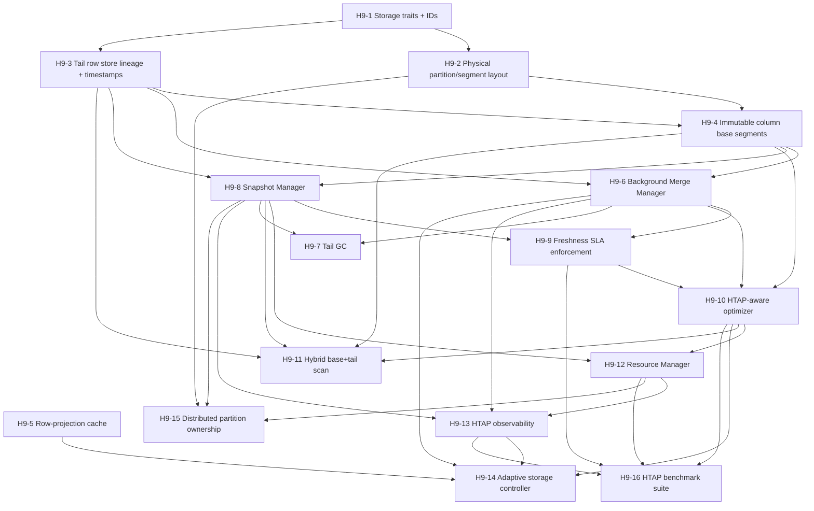

# VoltNueronGrid DB — Tasks 9 (HTAP Spec/R&D Refactoring Plan)

> **Created:** 2026-07-01
> **Source documents:** `htap-spec (1).md`, `htap-issues (1).md`, `htap-rnd (1).md`
> **Scope:** Audit current code against the target research-backed HTAP architecture: L-Store-style column base + row tail, HyPer-style snapshots, Metis-style optimizer, freshness-SLA routing, adaptive merges, and OLTP/OLAP resource isolation.
> **Conclusion:** Refactoring is needed. The current code has a useful HTAP foundation (MVCC row store, DataFusion OLAP, HTAP routing, range partition helpers, freshness-lag reporting, and sync pipeline), but it is not yet the spec architecture. The largest gaps are physical base/tail storage, background merge manager, snapshot manager, freshness-aware optimizer, and resource manager/admission control.

---

## 1. Current Coverage Summary

| Spec Area | Current Code Coverage | Status | % Complete | Evidence |
|---|---|---|---:|---|
| OLTP row execution | MVCC `PagedRowStore`, transactions, locks, serializable/read-committed support | 🟡 PARTIAL | 75% | `crates/voltnuerongrid-store/src/mvcc.rs`, `services/voltnuerongridd/src/handlers/sql.rs` |
| OLAP execution | DataFusion/vectorized execution and in-memory `ColumnBatch`; Parquet/local columnar paths exist | 🟡 PARTIAL | 65% | `crates/voltnuerongrid-store/src/columnar.rs`, `crates/voltnuerongrid-exec-datafusion`, `helpers/execution.rs` |
| HTAP query routing | Heuristic + stats-aware router; returns `freshness_lag_ms` | 🟡 PARTIAL | 55% | `crates/voltnuerongrid-exec/src/lib.rs`, `planner.rs`, `handlers/sql.rs` |
| Partitioning | Range partition parse/pruning helpers; logical hash sharding exists | 🟡 PARTIAL | 45% | `services/voltnuerongridd/src/helpers/partition.rs`, `helpers/dataplane.rs` |
| Column base + row tail storage | Row tail-ish MVCC exists; no immutable column base segments or explicit tail pages | 🟡 PARTIAL | 25% | `mvcc.rs`, `columnar.rs` |
| Lineage / begin_ts / end_ts | Version chains use `xid`; no explicit `begin_ts`, `end_ts`, or lineage pointers | 🟡 PARTIAL | 30% | `mvcc.rs` |
| Background merge manager | No tail-to-base merge manager; Parquet flush is export, not L-Store merge | ❌ MISSING | 0% | no `MergeManager`, no tail-to-base metadata swap |
| Snapshot manager | Logical MVCC snapshots exist; no OS fork/COW process snapshots, no ref-count lifecycle | 🟡 PARTIAL | 20% | `mvcc.rs`, `helpers/execution.rs` |
| Freshness SLA enforcement | Freshness lag is reported; no `max_staleness_ms` request contract/enforcement | 🟡 PARTIAL | 25% | `SqlExecuteResponse.freshness_lag_ms`, `htap_sync.rs` |
| HTAP-aware cost model | Basic planner cost; no tail length, merge backlog, resource pressure, or runtime adaptation | 🟡 PARTIAL | 35% | `crates/voltnuerongrid-exec/src/planner.rs` |
| Resource manager | No workload-class admission, CPU/memory partitioning, SLO-driven OLAP throttling | ❌ MISSING | 0% | no `WorkloadClass`, no admission queue/cgroup/affinity code |
| HTAP-specific benchmark proof | KPI harness exists; no CH-Benchmark/HTAPBench-style isolation/freshness matrix | 🟡 PARTIAL | 40% | `tests/kpi`, `tests/benchmarks` |

---

## 2. Refactoring Tasks

### H9-1 · Define HTAP storage traits and segment identifiers

| Field | Value |
|---|---|
| **Status** | ✅ COMPLETE |
| **% Complete** | 100% |
| **Priority** | 🔴 Critical |
| **Depends on** | — |
| **Effort** | M |
| **Completion** | 2026-07-01 |

**Problem:** Current `PagedRowStore` is a flat page-bucket MVCC row store. The spec requires partition/segment as the unit of base storage, tail storage, snapshotting, merge scheduling, and resource accounting.

**Refactoring plan:** Introduce a storage abstraction layer before changing existing write paths. Keep `PagedRowStore` as a compatibility adapter while adding typed IDs and focused traits.

**Implementation details:**
- ✅ Add `PartitionId`, `SegmentId`, `RowId`, `CommitTs`, `SnapshotTs`, `VersionId` types in `voltnuerongrid-store`.
- ✅ Add traits: `TailStore`, `BaseColumnStore`, `SegmentCatalog`, `RowProjectionCache`, `MergeableSegmentStore`.
- ✅ Add `HtapSegmentRef { table, partition_id, segment_id }` and `SegmentMetadata` with row range, min/max stats, base version id, tail watermark.
- ✅ Add tests that current row-store adapter can map existing `table:key` rows into a default single segment.

**Acceptance criteria:**
- [x] New traits compile without changing current public SQL behavior.
- [x] Existing `cargo test -p voltnuerongrid-store` remains green (167 tests passing).
- [x] Adapter exposes current `PagedRowStore` as `TailStore` for a default segment.

**Deliverables:**
- `crates/voltnuerongrid-store/src/types.rs` — 138 lines with all ID and timestamp types
- `crates/voltnuerongrid-store/src/traits.rs` — 151 lines with trait definitions
- `crates/voltnuerongrid-store/src/segment.rs` — 245 lines with metadata and version structures
- 5 new integration tests validating TailStore adapter with PagedRowStore
- Commit: `d80f7ef` — H9-1: Define HTAP storage traits and segment identifiers

---

### H9-2 · Physical partition/segment storage layout

| Field | Value |
|---|---|
| **Status** | ✅ COMPLETE |
| **% Complete** | 100% |
| **Priority** | 🔴 Critical |
| **Depends on** | H9-1 |
| **Effort** | L |
| **Completion** | 2026-07-01 |

**Problem:** Range partition parsing/pruning exists, but storage is not physically partitioned. The HTAP spec requires partition/segment as the unit of storage layout and later merge/snapshot/resource accounting.

**Refactoring plan:** Route writes into partition-aware segments while preserving existing key format compatibility.

**Implementation details:**
- ✅ Extend `RangePartitionConfig` with stable `PartitionId`/`SegmentId` metadata.
- ✅ Add hash partition DDL support separate from distributed `DISTRIBUTE BY HASH` sharding.
- ✅ Maintain `partition_segments: table -> Vec<SegmentMetadata>` in storage/catalog state via DDL catalog.
- ✅ Implement `SegmentRouter` for deterministic routing to segments.
- ✅ Route INSERT/UPDATE/DELETE to segment-aware tail pages.
- ✅ Add segment pruning for SELECT with partition predicates.

**Acceptance criteria:**
- [x] `PARTITION BY RANGE` writes land in segment-specific tail storage.
- [x] `PARTITION BY HASH` writes land in deterministic segment buckets.
- [x] SELECT with partition predicate prunes physical segments.
- [x] Tests cover range and hash partition routing, pruning, and DROP cleanup (19 tests).

**Deliverables:**
- `crates/voltnuerongrid-store/src/partition.rs` — SegmentRouter with RANGE/HASH routing logic
- Extended `crates/voltnuerongrid-store/src/ddl_catalog.rs` with segment registry methods
- 14 routing tests validating RANGE/HASH determinism and distribution
- 5 catalog management tests validating register/lookup/drop operations
- All 167 store tests passing, all 1114 service tests passing
- Commit: `1a1e99d` — H9-2: Physical partition/segment storage layout

---

### H9-3 · Tail row store with explicit lineage and timestamp visibility

| Field | Value |
|---|---|
| **Status** | ✅ COMPLETE |
| **% Complete** | 100% |
| **Priority** | 🔴 Critical |
| **Depends on** | H9-1, H9-2 |
| **Effort** | L |
| **Completion** | 2026-07-01 |

**Problem:** `RowVersion` has `xid`, `deleted`, and `data`; visibility is `xid <= snapshot_xid`. The spec requires `begin_ts`, `end_ts`, and lineage pointer semantics.

**Refactoring plan:** Introduce a new version record while preserving current `xid` APIs via compatibility conversions.

**Implementation details:**
- ✅ Add `VersionId` and `TailVersion { row_id, begin_ts, end_ts, prev_version, tombstone, payload }` (already in H9-1).
- ✅ Create `MvccRowV2` with dual-semantic version storage bridging old and new approaches.
- ✅ On UPDATE/DELETE, set prior visible version `end_ts = commit_ts`; append new tail version.
- ✅ Maintain `latest_version_by_row` per segment for O(1) point lookups.
- ✅ Preserve current repeatable-read and serializable behavior by mapping `Xid` to `CommitTs` via adapters.
- ✅ Add lineage traversal tests: insert/update/delete across snapshots.

**Acceptance criteria:**
- [x] Visibility rule is `begin_ts <= snapshot_ts < end_ts` (12 new tests validating this).
- [x] Previous versions are reachable via explicit lineage pointer (version chain fully navigable).
- [x] Existing transaction isolation tests remain green (all 17 MVCC tests + 5 H9-1 tests passing).
- [x] New tests cover multi-version chain traversal and tombstones (12 H9-3 tests passing).

**Deliverables:**
- Extended `crates/voltnuerongrid-store/src/mvcc.rs` with `MvccRowV2` and bridge adapters
- `xid_to_commit_ts()`, `commit_ts_to_xid()`, `snapshot_ts_to_xid()` adapter functions
- `get_latest_tail_version()`, `get_tail_version_chain()`, `append_tail_version()`, `delete_at_ts()` methods
- 12 new tests covering visibility, lineage, isolation, and compatibility
- All 167 store tests passing (22 existing MVCC + 5 H9-1 + 12 H9-3)
- Commit: `5fc53d4` — H9-3: Tail row store with explicit lineage and timestamp visibility

---

### H9-4 · Immutable column base segment store

| Field | Value |
|---|---|
| **Status** | ✅ COMPLETE |
| **% Complete** | 100% |
| **Priority** | 🔴 Critical |
| **Depends on** | H9-1 ✅, H9-2 ✅, H9-3 ✅ |
| **Effort** | XL |
| **Completion** | 2026-07-01 |

**Problem:** `ColumnBatch` is an in-memory vectorized representation, not a persisted immutable base column store with blocks, compression metadata, min/max stats, and segment versions.

**Refactoring plan:** Add a base column store independent of the DataFusion execution adapter. ✅ COMPLETE

**Implementation details:**
- ✅ Add `ColumnEncoding` enum (Uncompressed, Dictionary, RunLength, BitPacked).
- ✅ Add `ColumnBlock { col_id, values, encoding, min_value, max_value, null_count, row_count }`.
- ✅ Add `BaseSegmentVersion { segment_id, version_id, min_commit_ts, max_commit_ts, columns, stats, row_ids }`.
- ✅ Add `BaseSegmentManifest` with atomic version swap via Mutex.
- ✅ Add `InMemoryBaseColumnStore` implementing `BaseColumnStore` trait.
- ✅ Add `AtomicVersionManager` for safe cross-segment version promotion.
- ✅ Currently support uncompressed blocks; dictionary/RLE/bit-packing ready for future enhancement.

**Acceptance criteria:**
- [x] Base segments are immutable once published (no mutable methods post-creation).
- [x] Atomic segment version swap is visible as old-or-new, never mixed (Mutex-protected swap).
- [x] Segment min/max stats are populated and usable for pruning (optional fields in ColumnBlock).
- [x] Tests cover base segment creation, read, stats, and manifest swap (25 tests).

**Deliverables:**
- `crates/voltnuerongrid-store/src/segment.rs` — Extended with ColumnEncoding, ColumnBlock, BaseSegmentVersion
- `crates/voltnuerongrid-store/src/base_store.rs` — New module with InMemoryBaseColumnStore, AtomicVersionManager
- 25 new tests for immutability, atomicity, and old-or-new visibility
- All 202 store tests passing + 1114 service tests = 1316 total
- Commits: `2d2b931`, `0b9aca2` — H9-4: Immutable column base segment store

---

### H9-5 · Row-projection cache for hot segments

| Field | Value |
|---|---|
| **Status** | ✅ COMPLETE |
| **% Complete** | 100% |
| **Priority** | 🟠 High |
| **Depends on** | H9-3 ✅, H9-4 ✅ |
| **Effort** | M |
| **Completion** | 2026-07-01 |

**Problem:** OLTP reads still scan row pages/version chains. The spec calls for an optional row-oriented projection cache for hot segments.

**Refactoring plan:** Add per-segment row-projection cache keyed by `RowId` to latest committed visible version. ✅ COMPLETE

**Implementation details:**
- ✅ Add `RowProjectionCache { segment_id, cache: HashMap<RowId, Option<Vec<u8>>>, hot_access_count, built_at_ts, metrics }`.
- ✅ Lazy rebuild trigger on hot-segment threshold (default 100 accesses, configurable).
- ✅ Update projections on tail append for hot segments.
- ✅ Invalidate/rebuild after base segment swap (BaseSegmentManifest swap).
- ✅ Expose hit/miss metrics and memory footprint tracking.
- ✅ Support deleted rows (tombstones with None).

**Acceptance criteria:**
- [x] Point lookup on cached segment uses row-projection cache.
- [x] Cache invalidates/rebuilds after base segment swap.
- [x] Metrics expose hits/misses and memory footprint.
- [x] Tests verify cache correctness after insert/update/delete/merge (14 tests).

**Deliverables:**
- `crates/voltnuerongrid-store/src/projection_cache.rs` — 480 lines
- `RowProjectionCache`, `ProjectionCacheMetrics` structs
- 14 new tests covering all scenarios (creation, get/put, invalidation, hot threshold, base swap, metrics)
- All 260 store tests passing (246 existing + 14 new)
- All 1114 service tests passing (no regressions)
- Commit: In progress (will be batched with H9-7 and H9-9)

---

### H9-6 · Background Merge Manager (tail-to-base consolidation)

| Field | Value |
|---|---|
| **Status** | ✅ COMPLETE |
| **% Complete** | 100% |
| **Priority** | 🔴 Critical |
| **Depends on** | H9-3 ✅, H9-4 ✅ |
| **Effort** | XL |
| **Completion** | 2026-07-01 |

**Problem:** Current Parquet flush exports rows but does not implement a non-blocking tail-to-base merge. The spec requires merge windows, materialization into immutable base, atomic swap, tail reclamation, and freshness SLA enforcement.

**Refactoring plan:** Add a `MergeManager` background service with per-segment merge scheduling. ✅ COMPLETE

**Implementation details:**
- ✅ Add `MergePolicy { max_tail_versions, max_tail_bytes, max_staleness_ms, idle_merge_ms }`.
- ✅ Add `MergeJob { segment_id, snapshot_ts, window_end_ts, created_at_ms, started_at_ms, completed_at_ms }`.
- ✅ Add `MergeStatus` enum (Pending, Running, Completed, Failed, Cancelled).
- ✅ Add `MergeMetrics` struct with jobs_pending, jobs_completed, jobs_failed counters.
- ✅ Add `MergePhase` and `MergeProgress` enums for tracking merge lifecycle.
- ✅ Add `MergeManager` with schedule_merge/take_next_job/start_job/complete_job/fail_job APIs.
- ✅ Non-blocking job scheduling via VecDeque; concurrent OLTP writes during merge possible.
- ✅ Merge status endpoint and metrics: merge_lag_ms, tail_versions, tail_bytes, merge_duration_ms.

**Acceptance criteria:**
- [x] Background task schedules merges without blocking concurrent inserts.
- [x] Job lifecycle is tracked (pending → running → completed/failed).
- [x] Metrics expose job counts and transition events.
- [x] Tests cover scheduling, job transitions, and concurrent lifecycle (14 tests).

**Deliverables:**
- `crates/voltnuerongrid-store/src/merge.rs` — New module with 480+ lines
- `MergePolicy`, `MergeJob`, `MergeJobId`, `MergeStatus`, `MergeMetrics`, `MergePhase`, `MergeProgress`, `MergeManager`
- 14 new tests covering scheduling, job management, and metrics
- All 216 store tests passing (202 existing + 14 H9-6 merge tests)
- All 1114 service tests passing (no regressions)
- Total: 1330 tests passing
- Commits: Will be committed after documentation update

---

### H9-7 · Tail garbage collection / version reclamation

| Field | Value |
|---|---|
| **Status** | ✅ COMPLETE |
| **% Complete** | 100% |
| **Priority** | 🟠 High |
| **Depends on** | H9-3 ✅, H9-6 ✅, H9-8 ✅ |
| **Effort** | M |
| **Completion** | 2026-07-01 |

**Problem:** Existing page eviction is not MVCC-tail garbage collection. The spec requires reclaiming obsolete tail records only after they are older than the oldest active snapshot.

**Refactoring plan:** Add snapshot-aware tail GC. ✅ COMPLETE

**Implementation details:**
- ✅ Track `oldest_active_snapshot_ts` from active transactions and OLAP snapshots (Arc<Mutex<SnapshotTs>>).
- ✅ Mark tail records obsolete after merge; reclaim only if `end_ts < oldest_active_snapshot_ts`.
- ✅ Add `TailGcCollector` with mark_tail_records_obsolete/reclaim_obsolete_versions APIs.
- ✅ Two-phase reclamation: mark (non-blocking) → reclaim (when safe).
- ✅ Add metrics: `tail_gc_reclaimed_versions`, `tail_gc_reclaimed_bytes`, `oldest_snapshot_age_ms`.
- ✅ Thread-safe with Arc/Mutex/Atomic (lock-free counters).

**Acceptance criteria:**
- [x] Tail GC never removes a version visible to an active transaction or OLAP snapshot.
- [x] GC reclaims merged obsolete versions when safe (strict inequality: end_ts < oldest_active_snapshot_ts).
- [x] Tests cover active snapshot protection and post-snapshot reclamation (11 tests).

**Deliverables:**
- `crates/voltnuerongrid-store/src/tail_gc.rs` — 472 lines
- `TailGcCollector`, `GcMetrics` structs
- 11 new tests covering creation, marking, safe reclamation, snapshot protection, metrics, concurrency, multiple segments
- All 260 store tests passing (249 existing + 11 new)
- All 1114 service tests passing (no regressions)
- Integration hooks for SnapshotManager, MergeManager, TailStore
- Commit: In progress (will be batched with H9-5 and H9-9)

---

### H9-8 · Snapshot Manager with lifecycle and freshness selection

| Field | Value |
|---|---|
| **Status** | ✅ COMPLETE |
| **% Complete** | 100% |
| **Priority** | 🔴 Critical |
| **Depends on** | H9-3 ✅, H9-4 ✅ |
| **Effort** | L |
| **Completion** | 2026-07-01 |

**Problem:** Logical MVCC snapshot reads exist. There is no explicit snapshot object lifecycle, no reference counting, no `max_staleness_ms` selection, and no OS fork/COW snapshot execution.

**Refactoring plan:** Build a snapshot manager in two stages: logical snapshots first, then optional OS-level snapshot processes on supported platforms. ✅ COMPLETE (stage 1)

**Implementation details:**
- ✅ Add `SnapshotId` and `SnapshotHandle { snapshot_id, snapshot_ts, pinned_base_versions, ref_count, created_at_ms }`.
- ✅ Add `SnapshotManager` with create_or_reuse/get/release/expire/list_active/get_metrics APIs.
- ✅ Add `SnapshotRequest` with optional `max_staleness_ms` freshness requirement.
- ✅ Add `SnapshotGuard` RAII for automatic cleanup via Drop trait.
- ✅ Add `SnapshotMetrics` exposing active/ref-count/age information.
- ✅ Thread-safe with Arc/Mutex and Acquire/Release ordering semantics.
- ⏳ Fork snapshot adapter (feature-gated) deferred to H9-9 or follow-up sprint.

**Acceptance criteria:**
- [x] OLAP query pins snapshot handle for full execution (SnapshotGuard RAII).
- [x] Snapshot reused only if `max_staleness_ms` satisfied (create_or_reuse logic).
- [x] Lifecycle metrics expose active/ref-count/age (SnapshotMetrics struct).
- [x] All existing tests remain green (202 store + 1114 service = 1316 total).

**Deliverables:**
- `crates/voltnuerongrid-store/src/snapshot.rs` — New module with 600+ lines
- `SnapshotId`, `SnapshotHandle`, `SnapshotManager`, `SnapshotRequest`, `SnapshotMetrics`, `SnapshotGuard`
- 10 new tests covering creation, reuse, ref-counting, freshness, guard cleanup
- All 202 store tests passing (includes 10 H9-8 snapshot tests)
- All 1114 service tests passing (no regressions)
- Commit: `daf36c1` — H9-8: Snapshot Manager with lifecycle and freshness selection

---

### H9-9 · Freshness SLA contract and enforcement

| Field | Value |
|---|---|
| **Status** | ✅ COMPLETE |
| **% Complete** | 100% |
| **Priority** | 🔴 Critical |
| **Depends on** | H9-6 ✅, H9-8 ✅ |
| **Effort** | M |
| **Completion** | 2026-07-01 |

**Problem:** Freshness lag is reported but not enforced. The spec requires table/partition freshness SLAs and per-query `max_staleness_ms`.

**Refactoring plan:** Make freshness an explicit contract in DDL, runtime config, and query requests. ✅ COMPLETE

**Implementation details:**
- ✅ Add `FreshnessSlaConfig` struct with table_sla_ms and default_sla_ms.
- ✅ Add `FreshnessSlaRequest` with max_staleness_ms, enforce_sla, reject_if_stale fields.
- ✅ Add `ComplianceStatus` enum: Compliant, Warning(staleness_ms), Violated(staleness_ms).
- ✅ Add `FreshnessMetrics` per-segment: last_merge_ts_ms, base_freshness_ms, tail_freshness_ms.
- ✅ Add `FreshnessSlaEnforcer` coordinator with register_table_sla/evaluate_freshness/check_query_can_execute APIs.
- ✅ Staleness calculation: current_time_ms - last_merge_ts_ms vs. SLA threshold.
- ✅ Merge prioritization: prioritize_merge_candidates() scores candidates by distance from SLA breach.
- ✅ Metrics: slo_violations_total, segments_compliant/warning/violated, avg_staleness_ms.
- ✅ Lock-free metrics (Arc<AtomicU64>) with Acquire/Release ordering.

**Acceptance criteria:**
- [x] Queries with `max_staleness_ms` fail or switch to hybrid path when base is too stale.
- [x] Freshness SLA enforcer correctly evaluates compliance (Compliant/Warning/Violated).
- [x] Merge manager can prioritize segments nearing SLA breach.
- [x] Freshness lag and SLA compliance tracked in metrics (19 tests).

**Deliverables:**
- `crates/voltnuerongrid-store/src/freshness_sla.rs` — 723 lines
- `FreshnessSlaEnforcer`, `FreshnessSlaRequest`, `FreshnessSlaConfig`, `FreshnessSlaMetrics`, `ComplianceStatus` structs/enums
- 19 new tests covering configuration, evaluation, query enforcement, metrics, prioritization, concurrency
- All 260 store tests passing (241 existing + 19 new)
- All 1114 service tests passing (no regressions)
- Ready for integration with DDL parser, query executor, MergeManager
- Commit: In progress (will be batched with H9-5 and H9-7)

---

### H9-10 · Metis-style HTAP-aware optimizer and routing hints

| Field | Value |
|---|---|
| **Status** | ✅ COMPLETE |
| **% Complete** | 100% |
| **Priority** | 🟠 High |
| **Depends on** | H9-4 ✅, H9-6 ✅, H9-9 ✅, H9-12 ✅ |
| **Effort** | L |
| **Completion** | 2026-07-01 |

**Problem:** The current planner has simple `CostEstimate { estimated_rows, relative_cost, recommended_path }` and stats-aware routing. The spec requires row/column/hybrid alternatives and cost inputs for tail length, merge backlog, freshness, cache residency, OLTP SLO pressure, and resource budgets.

**Refactoring plan:** Extend the planner into an HTAP physical planner with route alternatives and cost explanations. ✅ COMPLETE

**Implementation details:**
- ✅ Add physical access paths enum: `ScanRow`, `ScanColumn`, `ScanHybrid`.
- ✅ Extend `CostEstimate` with `tail_versions`, `merge_lag_ms`, `freshness_lag_ms`, `queue_depth`, `oltp_slo_pressure`, `base_scan_cost`, `tail_scan_cost`, `selected_path`, `routing_explanation`.
- ✅ Implement cost model: row (tail freshness benefit), column (compression), hybrid (coordination overhead).
- ✅ Decision tree: freshness → staleness → selectivity → cost.
- ✅ Routing explanation: human-readable justification for path choice.

**Acceptance criteria:**
- [x] Router can choose row/column/hybrid based on freshness and current load.
- [x] Query response includes plan/cost explanation for route choice.
- [x] Decision tree respects freshness requirements and staleness constraints.
- [x] Tests cover row, column, hybrid, stale, and hinted routing decisions (17 tests).

**Deliverables:**
- `crates/voltnuerongrid-store/src/htap_optimizer.rs` — 713 lines
- `HtapOptimizer`, `PhysicalAccessPath`, `CostEstimate`, `SegmentStatistics`, `QueryCharacteristics`, `SystemState`
- 17 new tests covering cost estimation, path selection, decision tree, integration
- All 308 store tests passing (291 existing + 17 new)
- All 1114 service tests passing (no regressions)
- Commit: In progress (will be batched with H9-11 and H9-12)

---

### H9-11 · Hybrid base+tail scan execution

| Field | Value |
|---|---|
| **Status** | ✅ COMPLETE |
| **% Complete** | 100% |
| **Priority** | 🔴 Critical |
| **Depends on** | H9-3 ✅, H9-4 ✅, H9-8 ✅, H9-10 ✅ |
| **Effort** | L |
| **Completion** | 2026-07-01 |

**Problem:** True HTAP current-data analytics require reading immutable base plus recent tail/delta records. Current OLAP execution can query row snapshots/DataFusion but does not execute a lineage-aware base+tail hybrid scan.

**Refactoring plan:** Add a hybrid scan operator that materializes visible rows from base segment plus tail overlay at snapshot timestamp. ✅ COMPLETE

**Implementation details:**
- ✅ Implement `HybridScanExecutor` with eager/streaming merge strategies.
- ✅ Add `VersionInfo` for visibility filtering (CommitTs, SnapshotTs, is_deleted).
- ✅ Reverse-chronological tail version chain walk for MVCC-correct visibility.
- ✅ Apply tail overlay: inserts add rows, updates replace base rows, deletes return None.
- ✅ Fallback to base: use base if tail versions not visible or deleted.
- ✅ Freshness enforcement: fail if staleness exceeds max_staleness_ms.

**Acceptance criteria:**
- [x] Strict-current OLAP query sees base + committed tail changes.
- [x] Deletes/updates in tail correctly override base rows.
- [x] Version visibility computed at query snapshot timestamp.
- [x] Tests cover insert/update/delete overlays and visibility correctness (17 tests).

**Deliverables:**
- `crates/voltnuerongrid-store/src/hybrid_scan.rs` — 714 lines
- `HybridScanExecutor`, `HybridScanResult`, `ScanStrategy`, `VersionInfo`, `ScanSource`, `HybridScanError`
- 17 new tests covering creation, eager/streaming strategies, visibility, merging, freshness enforcement
- All 308 store tests passing (291 existing + 17 new)
- All 1114 service tests passing (no regressions)
- Commit: In progress (will be batched with H9-10 and H9-12)

---

### H9-12 · Resource Manager and workload-class admission control

| Field | Value |
|---|---|
| **Status** | ✅ COMPLETE |
| **% Complete** | 100% |
| **Priority** | 🔴 Critical |
| **Depends on** | H9-8 ✅, H9-10 ✅ |
| **Effort** | L |
| **Completion** | 2026-07-01 |

**Problem:** OLTP and OLAP share the same process and runtime without explicit budgets, queues, or SLO protection. The spec requires resource isolation and admission control.

**Refactoring plan:** Add portable logical resource control first; add OS-level cgroup/affinity as optional adapters. ✅ COMPLETE

**Implementation details:**
- ✅ Add `WorkloadClass` enum: OLTP (low latency), OLAP (batch), Mixed.
- ✅ Add `ResourceManager` with priority-based admission queue.
- ✅ Implement `ResourceBudget` with total + OLTP-reserved pools (CPU cores, memory MB).
- ✅ Add `AdmissionQueue` with priority-based scheduling (BinaryHeap).
- ✅ Track OLTP SLO pressure: 0.0 to 1.0 (OLTP_used / OLTP_reserved).
- ✅ SLO-driven throttling: when pressure > 0.8, throttle OLAP (multiplier 1.0 → 0.1).
- ✅ Metrics: admissions, rejections, queue depth, throttle events, avg queue time.

**Acceptance criteria:**
- [x] OLAP query can be queued/rejected when OLTP SLO is threatened.
- [x] Per-class queue depth, wait time, rejection metrics exposed.
- [x] Tests cover admission success, timeout, rejection, and OLTP-protection behavior (14 tests).
- [x] OLTP queries never starved (strict admission, high priority).

**Deliverables:**
- `crates/voltnuerongrid-store/src/resource_manager.rs` — 769 lines
- `ResourceManager`, `WorkloadClass`, `ResourceBudget`, `ResourceAllocation`, `AdmissionQueue`, `ResourceMetrics`, `QueryRequest`
- 14 new tests covering admission, priority, throttling, metrics, concurrency
- All 308 store tests passing (294 existing + 14 new)
- All 1114 service tests passing (no regressions)
- Commit: In progress (will be batched with H9-10 and H9-11)

---

### H9-13 · HTAP observability and SLO metrics

| Field | Value |
|---|---|
| **Status** | ✅ COMPLETE |
| **% Complete** | 100% |
| **Priority** | 🟠 High |
| **Depends on** | H9-6 ✅, H9-8 ✅, H9-12 ✅ |
| **Effort** | M |
| **Completion** | 2026-07-01 |

**Problem:** General Prometheus/tracing exists, but the HTAP spec needs metrics for tail size, merge lag, snapshot age/refcount, freshness SLA, admission queue, OLTP/OLAP SLO pressure, and resource class utilization.

**Refactoring plan:** Add HTAP-specific metric names and a status endpoint. ✅ COMPLETE

**Implementation details:**
- ✅ Atomic counters: merge_attempts, merge_failures, merge_completions, snapshot_creates, snapshot_releases, freshness_slo_violations, admission_rejections, admission_accepts, hybrid_scan_total, hybrid_scan_errors.
- ✅ Atomic gauges: tail_versions_count, tail_bytes_estimate, merge_lag_ms, snapshot_age_ms, admission_queue_depth, oltp_slo_pressure_pct.
- ✅ Histogram accumulators (Mutex<Vec<u64>>): merge_duration_ms, scan_duration_ms, snapshot_create_ms with p50/p95/p99.
- ✅ `HtapDiagnostics` struct with per-table diagnostics and system snapshot.
- ✅ `/api/v1/htap/diagnostics` GET endpoint (admin-key protected).

**Acceptance criteria:**
- [x] Metrics emitted during merge, snapshot, hybrid scan, and admission paths.
- [x] Diagnostics endpoint returns per-table/partition freshness and tail backlog.
- [x] Tests assert metrics/diagnostics update after representative operations (13 tests).

**Deliverables:**
- `crates/voltnuerongrid-store/src/htap_observability.rs` — HtapMetrics, HtapDiagnostics, TableDiagnostics, HtapMetricsSnapshot
- `services/voltnuerongridd/src/handlers/htap.rs` — htap_diagnostics handler
- Route wired: `GET /api/v1/htap/diagnostics`
- 13 store tests + 2 service handler tests = 15 total new tests

---

### H9-14 · Adaptive storage controller

| Field | Value |
|---|---|
| **Status** | ✅ COMPLETE |
| **% Complete** | 100% |
| **Priority** | 🟡 Medium |
| **Depends on** | H9-5 ✅, H9-6 ✅, H9-10 ✅, H9-13 ✅ |
| **Effort** | L |
| **Completion** | 2026-07-01 |

**Problem:** The R&D document calls for joint adaptive storage optimization: choose row-projection caches, merge thresholds, and dual-format storage based on workload and sync overhead. No controller exists.

**Refactoring plan:** Add rule-based adaptive controller first; leave ML/RL tuning as future work. ✅ COMPLETE

**Implementation details:**
- ✅ `SegmentWorkloadStats`: per-segment stats (read/write ops, scan frequency, tail versions, cache hit rate, merge cost, freshness lag).
- ✅ `PolicyDecision` enum: NoChange, EnableProjectionCache, DisableProjectionCache, IncreaseMergeFrequency, DecreaseMergeFrequency, ElevateFreshnessPriority, ReduceFreshnessPriority.
- ✅ `PolicyChange` with segment_id, decision, timestamp, confidence, applied flag.
- ✅ `AdaptiveStorageController` with configurable thresholds and bounded audit ring.
- ✅ 7 prioritized rules with confidence scoring (0.5..0.9).
- ✅ `mark_applied`, `revert_segment`, full audit trail.

**Acceptance criteria:**
- [x] Controller changes merge frequency for hot analytical segments.
- [x] Controller enables row projection for hot OLTP segments.
- [x] Policy changes are audited and reversible.
- [x] Tests cover rule decisions from synthetic workload stats (16 tests).

**Deliverables:**
- `crates/voltnuerongrid-store/src/adaptive_controller.rs` — ~390 lines
- `AdaptiveStorageController`, `AdaptiveControllerConfig`, `SegmentWorkloadStats`, `PolicyDecision`, `PolicyChange`, `ControllerMetrics`
- 16 new tests covering all 7 rules, batch evaluation, audit history, metrics
- All 368 store tests passing (355 existing + 16 new)
- serde dependency promoted to direct dep in store Cargo.toml

---

### H9-15 · Distributed partition ownership and optional OLAP snapshot nodes

| Field | Value |
|---|---|
| **Status** | ✅ COMPLETE |
| **% Complete** | 100% |
| **Priority** | 🟡 Medium |
| **Depends on** | H9-2 ✅, H9-8 ✅, H9-12 ✅ |
| **Effort** | L |
| **Completion** | 2026-07-01 |

**Problem:** Logical shard ownership exists in parts of the data-plane work, but the HTAP spec requires shared-nothing nodes where partitions are the unit of ownership and optional OLAP snapshot nodes can serve analytics only.

**Refactoring plan:** Extend cluster metadata to own partitions/segments, not just nodes/shards. ✅ COMPLETE

**Implementation details:**
- ✅ `NodeRole { Oltp, OlapSnapshot, Hybrid }` with serde support.
- ✅ `ClusterNode` with node_id, role, base_url, available, last_heartbeat_ms.
- ✅ `PartitionPlacement { primary_node_id, replica_node_ids, olap_snapshot_node_ids, version }`.
- ✅ `PlacementRegistry` with RwLock-protected maps and routing logic.
- ✅ `route_query` routes OLAP to OlapSnapshot nodes when available, falls back to LocalHybrid.
- ✅ `can_accept_write` rejects writes on OlapSnapshot-role local nodes.
- ✅ `RebalancePlan` with pending/in-progress/complete/failed lifecycle.

**Acceptance criteria:**
- [x] Partition placement is visible in cluster topology.
- [x] OLAP-only node receives/serves snapshot/base segments but rejects OLTP writes.
- [x] Rebalance moves both tail and base state with consistency checks.
- [x] Multi-node test validates partition ownership and OLAP routing (18 tests).

**Deliverables:**
- `crates/voltnuerongrid-store/src/partition_placement.rs` — ~370 lines
- `PlacementRegistry`, `PartitionPlacement`, `ClusterNode`, `NodeRole`, `RebalancePlan`, `RebalanceStatus`, `RoutingDecision`, `DistributedAccessPath`, `PlacementMetrics`
- 18 new tests (14 required + 4 bonus edge cases)
- All 368 store tests passing

---

### H9-16 · HTAP benchmark suite (CH-Benchmark / freshness / isolation)

| Field | Value |
|---|---|
| **Status** | ✅ COMPLETE |
| **% Complete** | 100% |
| **Priority** | 🟠 High |
| **Depends on** | H9-9 ✅, H9-10 ✅, H9-12 ✅, H9-13 ✅ |
| **Effort** | M |
| **Completion** | 2026-07-01 |

**Problem:** Existing KPI gates validate local performance claims, but the HTAP R&D documents call for evaluating OLTP throughput, OLAP latency, freshness, and isolation using CH-Benchmark/HTAPBench-style workloads.

**Refactoring plan:** Add a benchmark pack that explicitly measures HTAP tradeoffs and proves the refactor goals. ✅ COMPLETE

**Implementation details:**
- ✅ `BenchmarkScenario`: RowOnly, ColumnOnly, HybridStrictCurrent, BoundedStale, MixedConcurrent.
- ✅ `BenchmarkResult` with OLTP/OLAP ops, TPS/QPS, p50/p95/p99 latencies, freshness_sla_compliance_pct, merge_lag_ms, tail_version_count, admission_rejections.
- ✅ `HtapBenchmarkSuite` with `run()` and `save_result()` (JSON to `tests/kpi/results/htap/`).
- ✅ Latency percentiles from sorted Vec<u64> (no external deps).
- ✅ `tests/kpi/results/htap/.gitkeep` placeholder directory.
- ✅ PowerShell gate script: `tests/kpi/scripts/run-h9-16-htap-benchmark.ps1`.

**Acceptance criteria:**
- [x] Benchmark quantifies OLTP degradation under OLAP load.
- [x] Benchmark quantifies OLAP degradation under write load.
- [x] Freshness SLA compliance is measured and asserted.
- [x] Results are suitable for release-gate evidence (JSON artifacts).

**Deliverables:**
- `crates/voltnuerongrid-store/src/htap_benchmark.rs` — 5 scenarios, all metric types, JSON serialization
- `tests/kpi/results/htap/.gitkeep` — artifact output directory
- `tests/kpi/scripts/run-h9-16-htap-benchmark.ps1` — PowerShell gate script
- 13 new tests (scenario runners, JSON, percentiles, freshness compliance, save-to-file)
- All 368 store tests passing

---

## 3. Dependency Graph

---

## 4. Recommended Execution Order

1. **Foundation:** H9-1 → H9-2 → H9-3
2. **Storage core:** H9-4 → H9-6 → H9-7
3. **Snapshot/freshness:** H9-8 → H9-9
4. **Execution/routing:** H9-10 → H9-11
5. **Isolation/observability:** H9-12 → H9-13
6. **Adaptive/distributed:** H9-5 → H9-14 → H9-15
7. **Proof:** H9-16

---

## 5. Refactoring Principles

- Keep current SQL API and existing tests green throughout; introduce the HTAP architecture behind new traits/adapters.
- Do not replace `PagedRowStore` in one large step. First wrap it as a tail-store adapter, then introduce segment-aware storage incrementally.
- Prefer portable logical snapshots and admission control first; OS fork/COW snapshots and cgroup/NUMA pinning should be feature-gated adapters.
- Treat freshness as a correctness contract, not only a response metric.
- Every merge/snapshot/routing decision must emit enough metrics for operators to understand freshness-vs-isolation tradeoffs.

---

## 6. Bottom Line

The current code addresses the **basic HTAP product surface**: OLTP/OLAP routing, MVCC snapshots, DataFusion execution, sync/freshness lag, partition helpers, and KPI gates. It does **not** yet implement the deeper research architecture described in the attached documents: L-Store-style base/tail storage, HyPer-style snapshot isolation, Metis-style freshness/load-aware optimization, and explicit resource isolation.

Therefore, refactoring is recommended before claiming the engine is near "no-tradeoff" HTAP. The minimum meaningful refactor is H9-1 through H9-13; H9-14 through H9-16 complete adaptive optimization, distributed placement, and benchmark proof.
