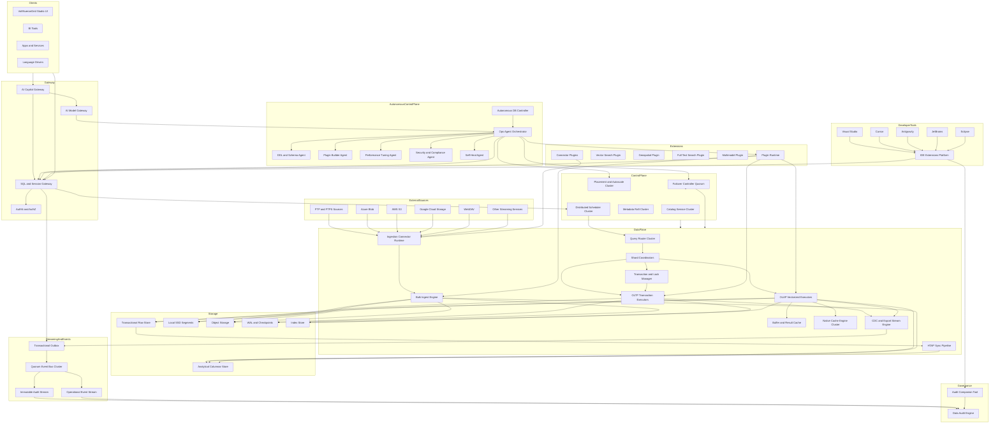

# VoltNueronGrid DB Design Document

## 1) Vision

`VoltNueronGrid DB` is a cloud-native and local-first HTAP database platform (OLTP + OLAP) written primarily in Rust, designed to replace in-memory MDAP processing with a persistent, massively parallel, low-latency engine.

The platform consists of:
- A distributed database engine (`voltnuerongridd`)
- A SQL/AI gateway and control plane
- A plugin runtime for multi-model and specialized extensions
- A separate UI client (`voltnuerongrid-studio`)
- Multi-language drivers and SDKs

Primary goal:
- Ingest very large datasets quickly from files and streams
- Serve analytical queries with very low latency at scale
- Support many concurrent users with secure multi-tenant architecture
- Use memory efficiently through vectorized execution, adaptive caching, and spill-to-disk controls

---

## 2) Non-Negotiable Product Principles

- **Rust-first core** for memory safety and predictable performance
- **SOLID-driven architecture** with strict interface boundaries
- **Plugin-extensible** like PostgreSQL extensions
- **ANSI SQL compliant baseline** with documented extensions
- **Scale-up and scale-out** in one architecture
- **Support for extremely large data** with trillion-row HTAP workloads (OLTP + OLAP)
- **Support for high-throughput OLTP** with strong transaction guarantees
- **Support for large concurrency** of users
- **No OOM or database crashes**
- **Local laptop and cloud SaaS deployment parity**
- **Observability, reliability, and fault tolerance by default**

---

## 3) Requirement Coverage Matrix

| # | Prompt Requirement | Design Response |
|---|---|---|
| 1 | ANSI SQL + native AI chat/extract/ingest/import/export | SQL parser and optimizer with ANSI baseline; in-engine AI copilot and AI functions; data movement service |
| 2 | Create DB/tables/views/materialized views/functions | Full DDL/DML engine and metadata catalog |
| 3 | Inbuilt functions in Rust/JS/Python | UDF runtime with WASM (Rust), JS isolate, Python sandbox |
| 4 | Multi-instance, HA, FT, reliable, elastic, i18n, UTF-8 | Raft metadata quorum, replicated storage, autoscaling policies, UTF-8 normalization and collation support |
| 5 | Separate data files and DB engine | Shared-nothing compute nodes + object/volume-backed storage layers |
| 6 | Import CSV/Parquet/JSON/Excel and stream from enterprise sources | Native bulk loader + ingestion connector plugins (FTP/FTPS, Azure Blob, S3, GCS, WebDAV, extensible adapters) |
| 7 | Extremely fast import with multithreading | Parallel readers, partitioned pipelines, vectorized transforms |
| 8 | Run local and cloud SaaS | Single-binary local mode + Kubernetes operator mode |
| 9 | Extensible plugins (vector, geospatial, search, multimodel, cache) | Stable plugin API with capability contracts and sandboxing |
| 10 | Trillions of rows, very fast retrieval, sharding | Partitioning, pruning, columnar zones, MPP execution, distributed indexes |
| 11 | Indexes and constraints | B-tree, bitmap, inverted/vector indexes; PK/FK/check/not-null/unique |
| 12 | Native seeded functions from plan-plat-pivotmdap + UDF | Seeded analytics function pack plus extensible function registry |
| 13 | Multi-user roles like Postgres | Role-based access control, schema/object privileges, row/column policies |
| 14 | UI client + engine | `voltnuerongrid-studio` web UI and admin console separated from core |
| 15 | Drivers for Python/Rust/Java/JS/C/C++/Perl/TS/Deno | Wire protocol + gRPC/HTTP APIs + language-specific SDKs |
| 16 | Support SSL plus encryption/decryption in DB | TLS 1.3 everywhere, envelope encryption, TDE, key rotation, crypto UDFs |
| 17 | Distributed engine with auto failover and zero data loss | Raft quorum writes, CSDB transaction routing, leader failover, sync commit mode |
| 18 | Stream data in and out + stream activity events | Streaming ingest/export APIs, CDC/event bus, immutable audit streams |
| 19 | Trillion-row scale with blazing ingest/update/read | Sharding, partitioning, vectorized MPP, log-structured write path, tiered caching |
| 20 | Deploy to Azure/AWS/GCP/Oracle, Docker, Kubernetes | Multi-cloud operator profiles and container-first deployment model |
| 21 | Any number of users | Stateless gateways, elastic worker pools, tenant-aware admission control |
| 22 | Pessimistic locking | Row/key-range locks with deadlock detection and timeout policies |
| 23 | Transactions support | ACID transactional model with single-shard and cross-shard execution paths |
| 24 | Config via properties/JSON/YAML | Central config service + file/env layered config loader |
| 25 | Native connection and connection pooling support | Built-in session router, pool manager, HA-aware driver pools, and tenant quotas |
| 26 | Streaming ingest from storage/protocol services via plugin model | Connector plugin SDK for source and sink streaming across cloud/object/protocol endpoints |
| 27 | Native cache engine (Redis-like and PostgreSQL-friendly) | Built-in distributed cache engine with protocol compatibility and database-aware invalidation |
| 28 | IDE extensions for DB operations and management | First-party extensions for Visual Studio, Cursor, Antigravity, JetBrains, and Eclipse |
| 29 | Fully autonomous operations via AI models/agents | Autonomous control plane for self-heal, self-tune, self-secure, self-operate, and AI-driven DB lifecycle actions |
| 30 | AI agent support for creating DB objects/plugins end-to-end | Governed agent workflows for creating databases, tables, views, functions, cache policies, vectors, and plugins |
| 31 | OLTP + OLAP on large data with extreme performance | HTAP architecture: row-store OLTP path + columnar OLAP path with real-time sync and unified SQL |

---

## 3.1 Legacy MDAP Aggregation Parity Baseline

Source used for parity input:
- `final-design/gap-analysis/AGGREGATION_TYPES_GAP_ANALYSIS.md`

Aggregation support target in VoltNueronGrid DB is split into rollout tiers to ensure compatibility with legacy in-memory behavior:

- **P0 (must-have parity):** `SUMMATION`, `AVERAGE`, `MINIMUM`, `MAXIMUM`, `INTERSECTIONSIZE/COUNT`, `NONE`, `INHERIT`, `OPENING`, `CLOSING`, `AND`, plus disaggregation `PROPORTIONAL`, `EQUAL`, `NONE`, `REPLICATION`
- **P1 (high-value parity):** `FORMULA`, `FLEXED_FORMULA`, `RELATIVE`, `RELATIVE_DELTA`, `LOOKUP`, `SINGLE_LEVEL_LOOKUP`, `SINGLE_LEVEL_LOOKUP_OPENING`, `SEGMENTED`, `SEGMENTED_DELTA`
- **P2 (deferred/conditional parity):** `SUM_NONE`, `CLOSING_ONLY`, `MULTIPLE`, `RANGE`, `SET`, `CONSENSUS`, `EXTERNAL_TRANSFER`, plus custom type registration

Design choice:
- Aggregation and disaggregation are implemented as pluggable operator families in `voltnuerongrid-exec`, so legacy semantics can be added without rewriting planner/storage.

## 4) High-Level Architecture



Legend (for walkthroughs):
- Blue path = OLTP transactional flow (`QROUTER -> COORD -> OLTPX -> ROW/WAL`)
- Green path = OLAP analytical flow (`QROUTER -> COORD -> OLAPX -> COL/CACHE`)
- Orange path = autonomous control flow (`AUTOCTL/OPSAG -> platform services`)

---

## 5) Core Subsystems

## 5.0 Anti-SPOF Architecture Guardrails (High and Medium Risk Closure)

- Control plane services (`CAT`, `SCHED`, `ORCH`) run as independent clustered services with N+1 capacity and quorum-backed leader election.
- Query path has no singleton coordinator: gateway routes to a query-router cluster, then shard coordinators are selected per query plan.
- Eventing uses transactional outbox plus quorum event bus; no direct best-effort publish from transaction path.
- Zero data loss policy is enforced by workload class: mission-critical workloads are pinned to `strict_sync`; non-critical classes may opt into bounded-loss mode.
- KMS dependencies are multi-region and multi-provider capable with envelope-key cache and controlled degradation policies.
- DR includes automated failover orchestration and tested failback state machine, not manual runbooks only.

## 5.1 SQL Layer (ANSI Compliance)

Components:
- SQL lexer/parser (ANTLR grammar or Rust parser framework)
- Semantic analyzer (name resolution, type checking)
- Logical planner
- Cost-based optimizer (CBO)
- Physical planner for vectorized operators

Feature scope:
- DDL: `CREATE/DROP/ALTER DATABASE|SCHEMA|TABLE|VIEW|MATERIALIZED VIEW|FUNCTION`
- DML: `INSERT/UPDATE/DELETE/MERGE`
- Query: `SELECT`, joins, aggregates, window functions, CTEs
- Transactions: snapshot isolation, read committed profile

Compliance strategy:
- Start with ANSI core profiles (entry/intermediate)
- Versioned compatibility matrix
- Dialect layer for optional syntax extensions

## 5.2 Query Engine

Execution model:
- Vectorized, columnar-aware operators
- Late materialization
- Predicate and projection pushdown
- Adaptive join strategy (hash, merge, nested, distributed broadcast/repartition)
- Distributed MPP plans for large datasets

Memory strategy:
- Arena allocation for operator lifetimes
- Slab allocators for tuple buffers
- Per-query memory budgets with spill orchestration
- Global cache quotas with tenant-aware fairness

Native cache engine (built-in, not plugin):
- Distributed in-memory cache cluster with sharding, replication, and failover
- Redis-compatible command subset for ecosystem interoperability
- PostgreSQL-friendly cache integration model (query/object cache invalidation by transaction events)
- Unified cache plane for result cache, metadata cache, and hot-key acceleration
- WAL-aware invalidation and TTL/priority eviction policies

## 5.3 Storage Engine

Hybrid model:
- Columnar segments for OLAP scans
- Row-oriented transactional store for OLTP write/read path
- Immutable segment files + compaction pipeline

Durability:
- WAL append on ingest/write path
- Async checkpointing
- Crash recovery through WAL replay and segment metadata reconciliation

Data layout:
- Partitioned by user-defined keys (date, tenant, region, etc.)
- Zone maps, min/max statistics, bloom summaries
- Compression codecs: ZSTD, LZ4, dictionary and RLE

## 5.3.1 HTAP architecture (OLTP + OLAP)

This architecture supports OLTP and OLAP together by design:
- **OLTP path:** row-store + WAL + pessimistic locking/MVCC for low-latency transactional operations
- **OLAP path:** columnar segments + vectorized execution for high-throughput analytical queries
- **Unification layer:** near-real-time change propagation from row-store to columnar store (micro-batch + streaming apply)
- **Query router:** routes point-lookups and short transactions to OLTP path; routes scans/aggregations to OLAP path; hybrid plans can join both

Key outcomes:
- High write throughput with ACID semantics
- High analytical throughput on very large datasets
- Single logical database surface (single SQL endpoint and catalog)

Competitive alignment:
- Oracle-like autonomous tuning for mixed workloads
- PostgreSQL/MySQL-like transactional behavior
- Cockroach-style distributed survivability and consistency controls

## 5.4 Ingestion Engine

Supported inputs:
- CSV
- Parquet
- JSON (NDJSON and JSON array modes)
- Excel (`.xls/.xlsx`)
- Streaming connectors (Kafka, Kinesis, Pub/Sub, OCI Streaming)
- Source connectors (plugin-driven): FTP (plain), FTPS (SSL/TLS), Azure Blob, AWS S3, Google Cloud Storage, WebDAV

Fast ingest path:
- Parallel file chunk readers
- SIMD parsers for CSV and typed conversion
- Multi-stage pipeline: read -> parse -> validate -> encode -> commit
- Backpressure-aware executor with configurable thread pools
- Batched WAL and group commit

Streaming in/out support:
- Continuous ingest jobs with exactly-once and at-least-once modes
- Streaming export sinks (object storage, message bus, CDC subscriptions)
- Backfill + live tail mode for historical + real-time pipelines
- Schema evolution controls for long-running streams

Connector plugin support:
- Connector SDK supports source, sink, and bidirectional adapters
- Built-in connector plugin set: FTP/FTPS, Azure Blob, S3, GCS, WebDAV
- Additional streaming services can be added through versioned connector plugins without core engine changes
- Connector security supports plaintext or TLS channels based on endpoint capability and policy

Activity and debug event stream:
- Every major activity emits structured events (ingest, commit, lock wait, failover, query lifecycle)
- Event payloads include correlation IDs, tenant IDs, shard IDs, and timing metadata
- Replay-safe and idempotent event contracts for debugging and forensic analysis
- Event publish path uses transactional outbox + idempotent relay to avoid data/event divergence

## 5.5 Metadata and Control Plane

Metadata scope:
- Databases/schemas/tables/indexes/materialized views/functions
- Stats, lineage, privileges, policies, plugin registration

Reliability:
- Metadata replicated via Raft
- Leader election and failover
- Point-in-time metadata snapshots

## 5.6 Security and Multi-User Roles

Security layers:
- Authentication: local users, LDAP/OIDC/SAML integration
- Authorization: role-based access control (RBAC)
- Fine-grained controls: schema/table/column/row level permissions
- Auditing: immutable security logs and admin actions
- Encryption: TLS in transit, encrypted files/keys at rest

SSL, encryption, and decryption architecture:
- TLS 1.3 for client connections, inter-node RPC, replication, and control-plane APIs
- Mutual TLS (mTLS) for node-to-node identity verification
- Transparent Data Encryption (TDE) for data files, WAL, and backups
- Envelope encryption with KMS/HSM-backed master keys (Azure Key Vault, AWS KMS, GCP KMS, OCI Vault)
- Online key rotation and re-encryption workflows with throttled background jobs
- Built-in cryptographic functions (encrypt/decrypt/hash/signature verify) with role-based key usage policies

Role examples:
- `sysadmin`, `dbadmin`, `analyst`, `etl`, `readonly`, custom roles

## 5.7 High Availability, Fault Tolerance, and Elasticity

HA model:
- Stateless gateways behind load balancers
- Replicated metadata quorum
- Data replication policy (sync/async) per table class

Fault tolerance:
- Node health detection
- Task retry and speculative execution for long scans
- Automatic shard rebalancing after failures

Automatic failover with zero-data-loss mode:
- Leader failure triggers sub-second election and transaction ownership transfer
- In-flight transactions are resumed/replayed from durable logs without semantic loss
- Commit level is policy-driven:
  - `strict_sync`: commit acknowledged only after quorum durability (zero data loss target)
  - `balanced_async`: optimized latency with bounded loss window for non-critical workloads
- Cross-shard transaction continuity through deterministic batch sequencing and shard-level replay

Control plane anti-SPOF measures:
- Active-active control-plane endpoints behind load balancers
- Independent quorum groups for metadata, scheduling, and failover control
- Lease-based fencing to prevent split-brain writers and schedulers
- Persistent scheduler state and deterministic task reassignment

Coordinator anti-SPOF measures:
- Query router cluster with stateless request admission and shard-aware routing
- Multiple shard coordinators per partition group with rapid ownership handoff
- Coordinatorless fragment execution fallback for long-running scans/aggregations

Elastic autoscaling:
- Metrics-driven scale-out of query workers
- Scheduled scale profiles for predictable business peaks
- Warm-pool nodes for fast burst handling

IP-grade distributed innovations (inspired by distributed-in-memory architecture):
- **ARS (Adaptive Redundancy Switching):** switch hot partitions to full replication and cold partitions to erasure mode
- **TAEC (Transaction-Aware Erasure Coding):** encode snapshots on transaction boundaries for consistent recovery
- **LTC (Latency-Tiered Consensus):** workload-tiered consensus timings for fast critical paths
- **CSDB (Cross-Shard Deterministic Batching):** avoid traditional 2PC bottlenecks with deterministic ordering
- **FPAP (Fault-Pattern Aware Placement):** placement uses failure correlation history, not just rack awareness
- **PRS (Parallel Replication Streams):** dependency-aware parallel replication for high write throughput

## 5.8 Plugin and Extension Framework

Plugin classes:
- Data type plugins
- Index plugins
- Query operator plugins
- Connector plugins
- AI model provider plugins
- Ingestion source/sink connector plugins

Initial plugin targets:
- Vector search (`HNSW`, `IVF`)
- Geospatial (`R-Tree`, geo functions)
- Full-text search (inverted index)
- Multimodel adapters (document/graph/wide-column)
- Data connector pack: FTP/FTPS, Azure Blob, AWS S3, Google Cloud Storage, WebDAV

Safety:
- Capability-based permissions
- Versioned ABI contracts
- Runtime isolation and kill switches

## 5.9 Native AI Capability

AI capabilities:
- Natural language to SQL with policy-aware guardrails
- Data profiling and anomaly suggestions
- Assisted schema mapping during import
- AI chat over selected datasets with access control context

Architecture:
- AI gateway service with pluggable model backends
- Prompt templates + semantic schema context
- Query validation and explainability layer before execution

## 5.9.1 Autonomous Database Operations (Oracle Autonomous-like)

Autonomous operating model:
- AI agents continuously monitor telemetry, logs, query plans, lock graphs, and anomaly signals.
- Autonomous controller executes runbooks and corrective actions under policy guardrails and approval modes.
- Supports three execution modes:
  - `advisory`: AI proposes actions only
  - `supervised`: AI executes pre-approved action classes
  - `fully_autonomous`: AI executes all permitted actions with continuous audit

Autonomous capabilities:
- **Self-heal:** detect and remediate node/process/query failures, rebalance shards, recover degraded replicas
- **Self-tune:** adjust indexes/statistics/cache policies/pool limits/parallelism based on workload
- **Self-secure:** rotate keys/certs, detect suspicious access patterns, enforce policy drift correction
- **Self-operate:** autonomous backups, patch windows, failover/failback orchestration, cost optimization
- **Self-document:** auto-generate post-incident reports and change summaries from event trails

AI agent action surface:
- Create/update database, schema, table, view, materialized view
- Create/update seeded/user functions and vector index policies
- Create/update cache policies and performance profiles
- Create/install/upgrade connector and extension plugins (through signed plugin supply chain)
- Execute competing autonomous DB features: automatic indexing, automatic statistics, automatic partitioning advisories, autonomous workload classification

Safety controls:
- Policy engine with scope limits, deny lists, and blast-radius caps
- Two-phase execution (`plan` -> `apply`) with simulation and rollback checks
- Mandatory audit records for every autonomous action
- Human override and emergency stop for autonomous loops

## 5.10 Internationalization and UTF-8

- UTF-8 everywhere in storage and APIs
- Unicode normalization pipeline (`NFC` baseline)
- ICU-backed collation and locale-aware sorting
- Multi-language metadata and UI labels

---

## 5.11 Data Audit Engine and Companion Tool

Data Audit Engine:
- Captures immutable row/column change history, query access events, privilege changes, and admin actions
- Supports compliance-grade retention, legal hold, tamper-evident hashing, and chain-of-custody metadata
- Correlates transaction IDs, session IDs, user identities, and workload tags for forensics
- Supports time-travel audit queries and export to SIEM/data-lake targets

Audit Companion Tool (`voltnuerongrid-audit-companion`):
- Operator and compliance UI/CLI for searching, replaying, and validating audit trails
- Diff views for who/what/when changes at schema/table/row level
- Rule authoring for anomaly detection (unusual access patterns, policy drift, key misuse)
- Evidence packaging for audits (SOC2/ISO/GDPR/internal controls)

---

## 6) Data Model and HTAP Design

Analytical structures (OLAP plane):
- Star and snowflake schema support
- Native dimension table optimization
- Fact table partitioning with surrogate keys
- Pre-aggregations and materialized cubes (future extension)

Transactional structures (OLTP plane):
- Row-oriented primary tables with normalized OLTP schemas
- Secondary indexes optimized for point lookups and short transactions
- Transactional write intents and commit metadata linked to MVCC snapshots

Materialized views:
- Incremental refresh and full refresh modes
- Refresh dependency tracking
- Query rewrite to use materialized views automatically

Constraints and indexes:
- Primary key, foreign key, unique, check, not-null
- Secondary indexes: B-tree, bitmap, inverted, vector
- Advanced indexes: BRIN-like block indexes and partial/filtered indexes for very large fact tables

Online schema evolution:
- Near-zero-downtime online DDL for add/drop/rename/index operations
- Dual-write and metadata swap patterns for heavy schema changes
- Editioned compatibility windows for rolling app/database updates

---

## 7) Function System (Seeded + UDF)

Seeded functions:
- Time intelligence (YTD, MTD, rolling windows)
- Pivot/unpivot helpers
- Statistical aggregates and percentile functions
- Dimension navigation functions
- Data cleansing and type casting utilities

Legacy function-family parity baseline from `plan-plat-pivotmdap` expression engine:
- Numeric/scalar: `ABS`, `POWER`, `LOG`, exponential, rounding families
- Conditional/control: `IF`, `ONLYIF`, `SWITCH`, status/no-value/error checks
- Time/window: lag, cumulative, accumulation functions
- Hierarchy/context: parent and attribute navigation functions
- Range and min/max families
- Coverage and duration families (cover, cover-closing, cover-duration variants)

Function compatibility strategy:
- Phase 1: map function families to native SQL/UDF equivalents
- Phase 2: compatibility package with legacy function aliases
- Phase 3: optimizer rewrites for high-frequency legacy function patterns

UDF execution runtimes:
- **Rust UDFs** via WASM (safe, high performance)
- **JavaScript ES6 UDFs** via embedded isolate
- **Python UDFs** in sandboxed worker processes

Lifecycle:
- `CREATE FUNCTION` registers metadata and runtime target
- Versioned deployment and rollback
- Resource governance (CPU/memory/timeouts)

---

## 8) UI Client (`voltnuerongrid-studio`)

Scope:
- SQL editor with autocomplete and explain plans
- Data explorer for schema browsing and previews
- Workload monitoring dashboard
- Access control administration
- AI chat assistant panel
- Import wizard for CSV/Parquet/JSON/Excel and connector-based streaming sources

Suggested stack:
- Frontend: React + TypeScript
- API: gRPC-web or REST over gateway
- Auth: OIDC with RBAC claims mapping

---

## 8.1 IDE Extensions Platform

First-party IDE extensions are provided for:
- Visual Studio
- Cursor
- Antigravity
- JetBrains (IntelliJ family)
- Eclipse

Core extension capabilities:
- Connection and credential profile management
- SQL editor with IntelliSense, linting, formatting, and execution plans
- Schema explorer, migration operations, and role/user management
- Ingest/export jobs, connector configuration, and stream monitoring
- Transaction/lock inspection, query tracing, and audit evidence workflows
- Plugin management and cluster administration actions

Architecture model:
- Extensions communicate through the SQL/session gateway and admin APIs
- Shared extension SDK keeps feature parity across IDE vendors
- Offline-safe project metadata cache with secure secret storage integration

---

## 9) Driver and SDK Strategy

Protocol options:
- Native wire protocol (`voltnuerongrid-wire`)
- PostgreSQL-compatible protocol bridge (optional compatibility mode)
- HTTP/REST for admin and lightweight integration
- gRPC for high-performance service integration

Required drivers:
- Python
- Rust
- Java
- JavaScript / TypeScript / Deno
- C / C++
- Perl

Driver capabilities:
- Prepared statements
- Bulk loading APIs
- Native connection pooling
- TLS and token auth
- Streaming result sets
- Retry and failover policies
- Consistent pooling semantics across all drivers with conformance tests
- Follower-read and bounded-staleness read hints

Competitive parity and differentiation:
- Postgres-style logical decoding compatible CDC contracts with replay slots/checkpoints
- Cockroach-style follower reads with bounded staleness for geo-distributed low-latency reads
- Oracle-style online schema changes and editioned deployment windows
- Neo4j-style graph projection plugin and Cypher-compatible query endpoint (plugin mode)
- Pinecone-style vector namespaces, metadata filters, and hybrid sparse+dense retrieval
- Query fingerprinting and plan regression guardrails (`pg_stat_statements`-style observability)

## 9.1 Native Connection and Pooling Architecture

Connection management is a first-class subsystem, not only a driver convenience.

Server-side components:
- **Connection Gateway:** terminates client sessions, authenticates, and routes to workers
- **Session Directory:** tracks live sessions, transaction affinity, and shard/workload placement
- **Pool Manager:** maintains worker connection pools (read pools, write pools, admin pools)
- **Pool Governor:** enforces tenant/user limits (`max_connections`, `max_pool_size`, queue timeouts)

Client/driver-side components:
- Language drivers include built-in pooling APIs with uniform semantics
- Separate pools for read/write and optional transaction-pinned sessions
- Adaptive pool resizing based on latency, error rate, and in-flight request depth

HA-aware pooling behavior:
- Health-aware endpoint selection (leader/follower/region-aware)
- Automatic connection draining during failover and rolling upgrades
- Fast reconnection with session re-auth and idempotent retry boundaries
- Circuit breaker and backoff policies to prevent retry storms

Operational controls:
- Pool metrics exported: active/idle, wait time, borrow latency, saturation, failover events
- Configurable via `.properties`, `.yaml`, `.json`, env vars
- Dynamic reconfiguration for safe limits without full restarts

---

## 10) Concurrency and Transaction Model

Concurrency:
- MVCC snapshots for readers
- Writer coordination with lock manager and optimistic validation
- Query admission control per tenant
- Workload classes (`interactive`, `batch`, `etl`)

Pessimistic locking support:
- Row-level, key-range, and partition-intent locks
- Lock modes: shared, update, exclusive, intent-shared, intent-exclusive
- Deadlock detection (wait-for graph) with victim selection policy
- Lock timeout and NOWAIT/SKIP LOCKED SQL behavior
- Lock observability views for operational debugging

Transactions:
- Single-shard ACID fast path
- Distributed transaction coordinator for multi-shard writes
- Savepoints and rollback semantics
- Serializable and snapshot isolation levels
- WAL-backed crash-safe commit protocol
- Transaction replay and idempotency tokens for retried client operations

---

## 11) Configuration and Control Plane Configuration Model

Supported configuration channels:
- `properties` files (Java ecosystem compatibility)
- `YAML` files
- `JSON` files
- Environment variables and secret references

Precedence order:
`CLI flags > env vars > tenant overrides > config file > defaults`

Config domains:
- Cluster topology and discovery
- TLS/certificates and key providers
- Sharding and replication policies
- Transaction defaults (isolation, lock timeout, sync level)
- Ingest/export stream settings
- Resource governance and autoscaling
- DR/failover targets (RTO/RPO, failover policy, failback policy)
- Event outbox/relay controls and audit retention

Hot reload policy:
- Safe runtime reload for non-breaking settings
- Controlled rolling restart for structural settings
- Full audit trail for configuration changes

## 11.1 Connection Pooling Configuration Contract

This section defines the baseline configuration contract for native connection pooling across gateway, engine, and all language drivers.

Design intent:
- Keep a single conceptual model across server and drivers
- Allow language-specific naming wrappers without changing semantics
- Expose safe defaults that work for local, self-managed, and SaaS

### 11.1.1 Canonical schema (logical model)

| Field | Type | Default | Scope | Description |
|---|---|---|---|---|
| `enabled` | boolean | `true` | server+driver | Enables pooling |
| `mode` | enum | `adaptive` | server+driver | `fixed` or `adaptive` pool sizing |
| `min_idle` | int | `8` | driver | Minimum idle connections kept warm |
| `max_size` | int | `128` | driver | Maximum total connections per pool |
| `acquire_timeout_ms` | int | `3000` | server+driver | Max wait to borrow connection before timeout |
| `idle_timeout_ms` | int | `300000` | server+driver | Idle connection eviction timeout |
| `max_lifetime_ms` | int | `1800000` | server+driver | Max connection age before recycle |
| `max_pending_acquires` | int | `2048` | server+driver | Queue depth for waiting borrowers |
| `validation_on_borrow` | boolean | `true` | server+driver | Health check connection before handing out |
| `validation_interval_ms` | int | `30000` | server+driver | Background validation frequency |
| `leak_detection_ms` | int | `60000` | driver | Warn if connection not returned in threshold |
| `read_write_split` | boolean | `true` | driver | Separate read and write pools |
| `transaction_pinning` | boolean | `true` | server+driver | Keep transaction on same backend connection |
| `load_balancing_policy` | enum | `latency_weighted` | driver | `round_robin`, `least_conn`, `latency_weighted` |
| `failover` | object | see below | server+driver | Reconnect and endpoint health behavior |
| `quotas` | object | see below | server | Per-user/per-tenant connection limits |
| `metrics` | object | see below | server+driver | Pool telemetry and export controls |

Failover object:
- `enabled` (default `true`)
- `health_check_interval_ms` (default `1000`)
- `unhealthy_threshold` (default `3`)
- `reconnect_backoff_min_ms` (default `50`)
- `reconnect_backoff_max_ms` (default `5000`)
- `drain_timeout_ms` (default `10000`)
- `retry_idempotent_only` (default `true`)

Quotas object:
- `max_connections_per_user` (default `200`)
- `max_connections_per_tenant` (default `20000`)
- `max_connections_global` (default `500000`)
- `burst_factor` (default `1.25`)

Metrics object:
- `enabled` (default `true`)
- `emit_interval_ms` (default `5000`)
- `include_histograms` (default `true`)
- `slow_acquire_threshold_ms` (default `100`)

### 11.1.2 YAML example (with defaults)

```yaml
voltnuerongrid:
  connection_pool:
    enabled: true
    mode: adaptive                # fixed | adaptive
    min_idle: 8
    max_size: 128
    acquire_timeout_ms: 3000
    idle_timeout_ms: 300000
    max_lifetime_ms: 1800000
    max_pending_acquires: 2048
    validation_on_borrow: true
    validation_interval_ms: 30000
    leak_detection_ms: 60000
    read_write_split: true
    transaction_pinning: true
    load_balancing_policy: latency_weighted
    failover:
      enabled: true
      health_check_interval_ms: 1000
      unhealthy_threshold: 3
      reconnect_backoff_min_ms: 50
      reconnect_backoff_max_ms: 5000
      drain_timeout_ms: 10000
      retry_idempotent_only: true
    quotas:
      max_connections_per_user: 200
      max_connections_per_tenant: 20000
      max_connections_global: 500000
      burst_factor: 1.25
    metrics:
      enabled: true
      emit_interval_ms: 5000
      include_histograms: true
      slow_acquire_threshold_ms: 100
```

### 11.1.3 JSON example (with defaults)

```json
{
  "voltnuerongrid": {
    "connection_pool": {
      "enabled": true,
      "mode": "adaptive",
      "min_idle": 8,
      "max_size": 128,
      "acquire_timeout_ms": 3000,
      "idle_timeout_ms": 300000,
      "max_lifetime_ms": 1800000,
      "max_pending_acquires": 2048,
      "validation_on_borrow": true,
      "validation_interval_ms": 30000,
      "leak_detection_ms": 60000,
      "read_write_split": true,
      "transaction_pinning": true,
      "load_balancing_policy": "latency_weighted",
      "failover": {
        "enabled": true,
        "health_check_interval_ms": 1000,
        "unhealthy_threshold": 3,
        "reconnect_backoff_min_ms": 50,
        "reconnect_backoff_max_ms": 5000,
        "drain_timeout_ms": 10000,
        "retry_idempotent_only": true
      },
      "quotas": {
        "max_connections_per_user": 200,
        "max_connections_per_tenant": 20000,
        "max_connections_global": 500000,
        "burst_factor": 1.25
      },
      "metrics": {
        "enabled": true,
        "emit_interval_ms": 5000,
        "include_histograms": true,
        "slow_acquire_threshold_ms": 100
      }
    }
  }
}
```

### 11.1.4 Properties example (with defaults)

```properties
voltnuerongrid.connection_pool.enabled=true
voltnuerongrid.connection_pool.mode=adaptive
voltnuerongrid.connection_pool.min_idle=8
voltnuerongrid.connection_pool.max_size=128
voltnuerongrid.connection_pool.acquire_timeout_ms=3000
voltnuerongrid.connection_pool.idle_timeout_ms=300000
voltnuerongrid.connection_pool.max_lifetime_ms=1800000
voltnuerongrid.connection_pool.max_pending_acquires=2048
voltnuerongrid.connection_pool.validation_on_borrow=true
voltnuerongrid.connection_pool.validation_interval_ms=30000
voltnuerongrid.connection_pool.leak_detection_ms=60000
voltnuerongrid.connection_pool.read_write_split=true
voltnuerongrid.connection_pool.transaction_pinning=true
voltnuerongrid.connection_pool.load_balancing_policy=latency_weighted
voltnuerongrid.connection_pool.failover.enabled=true
voltnuerongrid.connection_pool.failover.health_check_interval_ms=1000
voltnuerongrid.connection_pool.failover.unhealthy_threshold=3
voltnuerongrid.connection_pool.failover.reconnect_backoff_min_ms=50
voltnuerongrid.connection_pool.failover.reconnect_backoff_max_ms=5000
voltnuerongrid.connection_pool.failover.drain_timeout_ms=10000
voltnuerongrid.connection_pool.failover.retry_idempotent_only=true
voltnuerongrid.connection_pool.quotas.max_connections_per_user=200
voltnuerongrid.connection_pool.quotas.max_connections_per_tenant=20000
voltnuerongrid.connection_pool.quotas.max_connections_global=500000
voltnuerongrid.connection_pool.quotas.burst_factor=1.25
voltnuerongrid.connection_pool.metrics.enabled=true
voltnuerongrid.connection_pool.metrics.emit_interval_ms=5000
voltnuerongrid.connection_pool.metrics.include_histograms=true
voltnuerongrid.connection_pool.metrics.slow_acquire_threshold_ms=100
```

### 11.1.5 Recommended environment profiles

- `local-dev`: `max_size=32`, `max_connections_global=5000`, short timeouts for quick feedback
- `self-managed-prod`: `max_size=128`, `max_connections_global=200000`, conservative failover drain
- `saas-prod`: `max_size=256`, `max_connections_global=500000+`, strict tenant quotas and adaptive mode required

## 11.2 Native Cache Engine Configuration Contract

This section defines the baseline configuration contract for the built-in distributed cache engine (Redis-like interoperability + database-aware invalidation).

Design intent:
- Keep one canonical cache contract for server and management tooling
- Allow workload-tier overrides (interactive, batch, etl, admin)
- Default to safe memory governance and predictable failover

### 11.2.1 Canonical schema (logical model)

| Field | Type | Default | Scope | Description |
|---|---|---|---|---|
| `enabled` | boolean | `true` | server | Enables native cache engine |
| `mode` | enum | `hybrid` | server | `result_only`, `metadata_only`, `hybrid` |
| `cluster.shards` | int | `16` | server | Number of cache shards |
| `cluster.replication_factor` | int | `3` | server | Replicas per shard |
| `cluster.failover_timeout_ms` | int | `2000` | server | Failover promotion timeout |
| `memory.max_bytes` | string | `"16GB"` | server | Max cache memory budget |
| `memory.high_watermark_pct` | int | `85` | server | Start aggressive eviction at threshold |
| `memory.low_watermark_pct` | int | `70` | server | Stop aggressive eviction below threshold |
| `eviction.policy` | enum | `allkeys_lfu` | server | `allkeys_lru`, `allkeys_lfu`, `volatile_ttl` |
| `eviction.scan_batch` | int | `1024` | server | Entries scanned per eviction cycle |
| `ttl.default_sec` | int | `300` | server | Default TTL when not specified |
| `ttl.max_sec` | int | `86400` | server | Maximum allowed TTL |
| `hot_key_protection.enabled` | boolean | `true` | server | Enables hot-key shedding/protection |
| `hot_key_protection.qps_threshold` | int | `5000` | server | QPS trigger for hot-key controls |
| `warmup.enabled` | boolean | `true` | server | Enables startup/restart cache warmup |
| `warmup.sources` | list | `["materialized_views","query_history"]` | server | Warmup sources |
| `invalidation.mode` | enum | `txn_event_driven` | server | `txn_event_driven`, `ttl_only`, `manual` |
| `invalidation.batch_size` | int | `2000` | server | Invalidation events per apply batch |
| `consistency.read_policy` | enum | `read_my_writes` | server | `eventual`, `read_my_writes`, `strict` |
| `namespaces.enabled` | boolean | `true` | server | Enables tenant/workload cache namespaces |
| `namespaces.max_per_tenant` | int | `256` | server | Namespace cap per tenant |
| `compat.redis_protocol.enabled` | boolean | `true` | server | Enables Redis-compatible protocol subset |
| `compat.redis_protocol.port` | int | `6380` | server | Redis compatibility listener port |
| `security.tls_required` | boolean | `true` | server | Require TLS for cache endpoints |
| `security.auth_required` | boolean | `true` | server | Require auth for cache operations |
| `metrics.enabled` | boolean | `true` | server | Enables cache metrics export |
| `metrics.emit_interval_ms` | int | `5000` | server | Metrics emission interval |

### 11.2.2 YAML example (with defaults)

```yaml
voltnuerongrid:
  cache_engine:
    enabled: true
    mode: hybrid                  # result_only | metadata_only | hybrid
    cluster:
      shards: 16
      replication_factor: 3
      failover_timeout_ms: 2000
    memory:
      max_bytes: 16GB
      high_watermark_pct: 85
      low_watermark_pct: 70
    eviction:
      policy: allkeys_lfu         # allkeys_lru | allkeys_lfu | volatile_ttl
      scan_batch: 1024
    ttl:
      default_sec: 300
      max_sec: 86400
    hot_key_protection:
      enabled: true
      qps_threshold: 5000
    warmup:
      enabled: true
      sources: [materialized_views, query_history]
    invalidation:
      mode: txn_event_driven      # txn_event_driven | ttl_only | manual
      batch_size: 2000
    consistency:
      read_policy: read_my_writes # eventual | read_my_writes | strict
    namespaces:
      enabled: true
      max_per_tenant: 256
    compat:
      redis_protocol:
        enabled: true
        port: 6380
    security:
      tls_required: true
      auth_required: true
    metrics:
      enabled: true
      emit_interval_ms: 5000
```

### 11.2.3 JSON example (with defaults)

```json
{
  "voltnuerongrid": {
    "cache_engine": {
      "enabled": true,
      "mode": "hybrid",
      "cluster": {
        "shards": 16,
        "replication_factor": 3,
        "failover_timeout_ms": 2000
      },
      "memory": {
        "max_bytes": "16GB",
        "high_watermark_pct": 85,
        "low_watermark_pct": 70
      },
      "eviction": {
        "policy": "allkeys_lfu",
        "scan_batch": 1024
      },
      "ttl": {
        "default_sec": 300,
        "max_sec": 86400
      },
      "hot_key_protection": {
        "enabled": true,
        "qps_threshold": 5000
      },
      "warmup": {
        "enabled": true,
        "sources": ["materialized_views", "query_history"]
      },
      "invalidation": {
        "mode": "txn_event_driven",
        "batch_size": 2000
      },
      "consistency": {
        "read_policy": "read_my_writes"
      },
      "namespaces": {
        "enabled": true,
        "max_per_tenant": 256
      },
      "compat": {
        "redis_protocol": {
          "enabled": true,
          "port": 6380
        }
      },
      "security": {
        "tls_required": true,
        "auth_required": true
      },
      "metrics": {
        "enabled": true,
        "emit_interval_ms": 5000
      }
    }
  }
}
```

### 11.2.4 Properties example (with defaults)

```properties
voltnuerongrid.cache_engine.enabled=true
voltnuerongrid.cache_engine.mode=hybrid
voltnuerongrid.cache_engine.cluster.shards=16
voltnuerongrid.cache_engine.cluster.replication_factor=3
voltnuerongrid.cache_engine.cluster.failover_timeout_ms=2000
voltnuerongrid.cache_engine.memory.max_bytes=16GB
voltnuerongrid.cache_engine.memory.high_watermark_pct=85
voltnuerongrid.cache_engine.memory.low_watermark_pct=70
voltnuerongrid.cache_engine.eviction.policy=allkeys_lfu
voltnuerongrid.cache_engine.eviction.scan_batch=1024
voltnuerongrid.cache_engine.ttl.default_sec=300
voltnuerongrid.cache_engine.ttl.max_sec=86400
voltnuerongrid.cache_engine.hot_key_protection.enabled=true
voltnuerongrid.cache_engine.hot_key_protection.qps_threshold=5000
voltnuerongrid.cache_engine.warmup.enabled=true
voltnuerongrid.cache_engine.warmup.sources=materialized_views,query_history
voltnuerongrid.cache_engine.invalidation.mode=txn_event_driven
voltnuerongrid.cache_engine.invalidation.batch_size=2000
voltnuerongrid.cache_engine.consistency.read_policy=read_my_writes
voltnuerongrid.cache_engine.namespaces.enabled=true
voltnuerongrid.cache_engine.namespaces.max_per_tenant=256
voltnuerongrid.cache_engine.compat.redis_protocol.enabled=true
voltnuerongrid.cache_engine.compat.redis_protocol.port=6380
voltnuerongrid.cache_engine.security.tls_required=true
voltnuerongrid.cache_engine.security.auth_required=true
voltnuerongrid.cache_engine.metrics.enabled=true
voltnuerongrid.cache_engine.metrics.emit_interval_ms=5000
```

### 11.2.5 Recommended environment profiles

- `local-dev`: `max_bytes=2GB`, `replication_factor=1`, `default_ttl=120`, warmup disabled
- `self-managed-prod`: `max_bytes=16GB+`, `replication_factor=3`, `allkeys_lfu`, `read_my_writes`
- `saas-prod`: namespace isolation required, `replication_factor>=3`, hot-key protection mandatory, strict auth/tls

### 11.2.6 Cache tuning playbook (Ops quick reference)

| Symptom | Primary knob(s) | Expected effect |
|---|---|---|
| High cache miss rate on repeated queries | Increase `memory.max_bytes`; raise `ttl.default_sec`; enable `warmup.enabled` | Higher hit ratio, lower repeated compute latency |
| Frequent eviction churn / cache thrashing | Switch `eviction.policy` to `allkeys_lfu`; increase `memory.high_watermark_pct` gap; increase `memory.max_bytes` | Fewer useful-key evictions, more stable cache residency |
| Hot key overload (single-key QPS spikes) | Lower `hot_key_protection.qps_threshold`; keep `hot_key_protection.enabled=true`; increase shard count | Reduced hotspot amplification, improved tail latency |
| Stale reads after heavy writes | Set `invalidation.mode=txn_event_driven`; increase `invalidation.batch_size`; move `consistency.read_policy` to `read_my_writes` or `strict` | Faster invalidation propagation and stronger read freshness |
| Failover takes too long | Reduce `cluster.failover_timeout_ms`; ensure `cluster.replication_factor>=3`; validate health checks | Faster promotion/recovery and lower availability impact |
| High memory pressure / OOM risk | Reduce `ttl.default_sec`; lower `memory.high_watermark_pct`; tighten namespace limits | Lower memory occupancy and safer eviction onset |
| Too many small namespaces per tenant | Lower `namespaces.max_per_tenant`; enforce naming policy | Reduced metadata overhead and improved cache management |
| Cache endpoint security concerns | Keep `security.tls_required=true`; keep `security.auth_required=true`; disable `compat.redis_protocol` where not needed | Stronger security posture with reduced protocol exposure |
| Metrics overhead too high | Increase `metrics.emit_interval_ms`; disable heavy histograms in constrained envs | Lower telemetry overhead while retaining core visibility |
| Slow cold start after restart | Enable `warmup.enabled`; expand `warmup.sources` to include frequent workloads | Faster post-restart recovery of cache effectiveness |

---

## 12) Performance Targets and SLOs

Realistic target framing:
- Nanosecond end-to-end latency is not realistic for distributed analytics; target lightning-fast practical SLAs with microsecond-level operator execution and millisecond-level user-perceived results.
- Design target is **sub-second interactive OLAP**, **low-millisecond OLTP p95 latency**, and **single-digit millisecond metadata/index lookups** in hot-cache scenarios.
- Data scale target is **trillion-row class datasets** with partition pruning and distributed execution.

SLO examples:
- P95 interactive query latency: < 800 ms for benchmark dashboard workloads
- P99 metadata lookup: < 10 ms
- Bulk ingest/update throughput: near-linear scaling with workers until network/IO ceilings
- Availability target: 99.95%+ for managed SaaS tiers
- RPO target (critical profiles): 0 in `strict_sync` mode
- RTO target (single-node failure): < 30 seconds automated recovery for critical services

---

## 13) Deployment Topologies

## 13.1 Local Developer Mode

- Single node binary (`voltnuerongridd`)
- Embedded metadata and local storage
- Optional local object storage adapter
- Ideal for laptops and CI tests

## 13.2 Self-Managed Cluster

- Kubernetes deployment with operator
- Stateful storage classes + object store
- Horizontal scaling for query workers
- Docker Compose reference profile for smaller deployments

Cloud deployment profiles:
- Microsoft Azure (AKS, Blob Storage, Key Vault, Monitor)
- AWS (EKS, S3, KMS, CloudWatch)
- Google Cloud (GKE, GCS, Cloud KMS, Cloud Operations)
- Oracle Cloud (OKE, Object Storage, OCI Vault, Monitoring)

## 13.3 Managed SaaS

- Multi-tenant control plane
- Isolated compute pools
- Consumption-based autoscaling
- Built-in backup, monitoring, and upgrades

---

## 14) Reliability, Backup, and Disaster Recovery

Backup strategy:
- Incremental snapshots + WAL archiving
- Tiered backup retention policies
- Cross-region replicated backup copies

Recovery:
- Point-in-time restore (PITR)
- Region failover runbooks
- Metadata quorum recovery procedures

Automated DR orchestration:
- Quorum-based failover controller with health scoring and fencing
- Explicit failover state machine: detect -> freeze -> promote -> reroute -> validate
- Explicit failback state machine with data convergence checks
- Published RTO/RPO classes by workload tier

Event and audit durability:
- Transactional outbox on write path
- Quorum event log persistence with cross-region replication
- Audit stream immutability verification and periodic integrity checks

---

## 15) Observability and Operations

Telemetry:
- OpenTelemetry traces
- Prometheus metrics
- Structured logs with correlation IDs

Dashboards:
- Query latency and throughput
- Ingestion pipeline health
- Cache hit ratios
- Compaction backlog
- Replication lag
- Query fingerprint cardinality and plan drift/regression
- Pool saturation, failover drain time, reconnect storm indicators
- Audit event throughput, lag, and integrity-check status

Alerts:
- SLO violations
- Replication/consensus failures
- Disk/memory pressure
- Security anomalies

---

## 16) SOLID-Driven Rust Module Architecture

Suggested crate layout:

- `voltnuerongrid-core`: domain models, shared traits
- `voltnuerongrid-sql`: parser, analyzer, planner interfaces
- `voltnuerongrid-opt`: optimizer and statistics framework
- `voltnuerongrid-exec`: execution operators and runtime
- `voltnuerongrid-store`: storage engine and WAL
- `voltnuerongrid-meta`: metadata and catalog services
- `voltnuerongrid-ingest`: file readers and ingest pipelines
- `voltnuerongrid-plugins`: plugin SDK/runtime
- `voltnuerongrid-ai`: AI orchestration and safe query generation
- `voltnuerongrid-auth`: authn/authz and policy engine
- `voltnuerongrid-audit`: audit capture, retention, integrity verification
- `voltnuerongrid-failover`: failover controller and orchestration state machines
- `voltnuerongrid-server`: gateway and service hosting
- `voltnuerongrid-driver-*`: language driver implementations
- `voltnuerongrid-studio`: web UI
- `voltnuerongrid-audit-companion`: compliance/forensics companion UI and CLI

SOLID examples:
- Single Responsibility: parser, optimizer, executor fully isolated
- Open/Closed: plugin interfaces extend behavior without core modification
- Liskov: trait contracts enforce substitutable operator implementations
- Interface Segregation: separate traits for scan, index, commit, cache
- Dependency Inversion: services depend on trait abstractions, not concrete engines

---

## 17) Security and Compliance Considerations

- Secure defaults (TLS required in production)
- Secret management through vault integrations
- Data masking policies for sensitive columns
- Audit retention and immutable logs
- Compliance-ready controls for SOC2/ISO27001 pathways

---

## 18) Open Risks and Mitigation

Risk areas:
- Building SQL + distributed HTAP + plugin + AI in one release can over-expand scope
- Python/JS UDF safety and determinism
- Excel ingestion edge-case complexity
- Multi-cloud KMS behavior divergence and key management complexity
- Increased architecture complexity from anti-SPOF and competitive feature depth

Mitigation:
- Phased release with strict milestones
- Safe subset first for UDF runtimes
- Compatibility test matrix for imports and drivers
- RTO/RPO game days and chaos validation integrated into release gates
- Feature-flag strategy and progressive enablement by tenant tier

---

## 18.1 SPOF Traceability Matrix (Governance Sign-Off)

| SPOF Risk | Mitigation in Architecture | Execution Epic/Task | Acceptance Test / Evidence |
|---|---|---|---|
| Control-plane singleton (`CAT`/`SCHED`/`ORCH`) | Independent clustered services, quorum election, lease fencing | `voltnuerongrid-ws.md` -> `E6.6 Anti-SPOF Hardening` | Multi-node control-plane chaos test; scheduler failover with no admission outage |
| Query coordinator singleton | Query-router cluster + redundant shard coordinators + fragment fallback | `voltnuerongrid-ws.md` -> `E6.6`; `E10.5 Gateway and Session Routing` | Kill coordinator under load; query completion and bounded retry latency validated |
| Event publication loss/divergence | Transactional outbox + idempotent relay + quorum event bus persistence | `voltnuerongrid-ws.md` -> `E6.6`; `E14.3 Advanced Control Contracts` | Outbox-to-bus exactly-once durability test during crash/restart and partition events |
| Zero-loss claim violated by async profiles | Mandatory `strict_sync` for critical workload classes with policy enforcement | `voltnuerongrid-ws.md` -> `E6.5 Zero Data Loss Failover`; `E14.3` | Policy conformance tests prove critical tenants cannot run with bounded-loss profile |
| External KMS dependency outage | Multi-region/provider KMS support + envelope-key cache + controlled degradation | `voltnuerongrid-ws.md` -> `E6.6`; `E5.4 SSL, Encryption, and Decryption` | Regional KMS fault-injection test verifies read/write continuity within policy bounds |
| DR only manual/runbook-based | Quorum failover controller + automated failover/failback state machines | `voltnuerongrid-ws.md` -> `E12.2a Automated DR and SLO Governance` | DR game-day evidence with declared RTO/RPO class compliance |
| Connection/session subsystem centralization | Connection gateway and session directory deployed as clustered stateless/control services | `voltnuerongrid-ws.md` -> `E10.5`; `E10.4` | Rolling upgrade + node loss test with no session-loss for retryable operations |
| Auditability and evidence pipeline gaps | Native Data Audit Engine + companion tool with integrity checks and evidence packaging | `voltnuerongrid-ws.md` -> `Epic 8A` | Legal-hold, tamper-evidence, and audit bundle generation validated |

Sign-off rule:
- Governance sign-off requires all High/Medium SPOF rows to show `Implemented` status and linked evidence artifacts from chaos/DR/performance validation runs.

---

## 19) Delivery Roadmap (Macro)

- Phase 1: Core single-node HTAP engine (OLTP + OLAP), SQL, ingest, basic RBAC
- Phase 2: Distributed execution, anti-SPOF control/data plane hardening, autoscaling
- Phase 3: Audit engine and companion tool, competitive parity features (CDC/follower reads/online DDL), connector plugin pack, autonomous AI ops baseline
- Phase 4: Managed SaaS hardening, enterprise governance, full autonomous DB maturity, and global DR certification

---

## 20) Definition of Done (Architecture)

Architecture is complete when:
- All documented requirements (including SPOF High/Medium closures) are implemented or have scheduled GA milestones
- SLOs are measurable in production
- Security and audit controls are enforced
- Drivers and UI are production-ready
- Runbooks and operational dashboards are available

