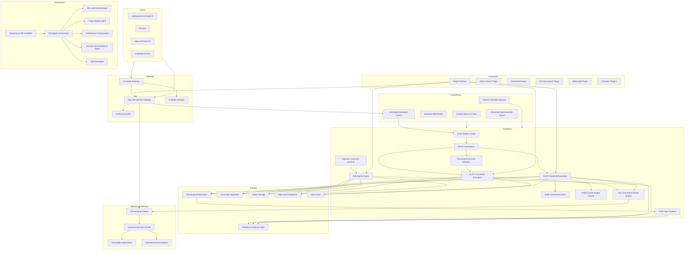

# VoltNueronGrid DB — Architecture, Design & Patterns

## 1. Project Overview

**VoltNueronGrid DB** is a Rust-first HTAP (Hybrid Transactional/Analytical Processing) database platform designed to replace in-memory MDAP (Multi-Dimensional Analytical Processing) workloads with a persistent, scalable, low-latency engine. It targets both OLTP and OLAP workloads with support for trillions of rows, enterprise security, multi-tenant isolation, and autonomous operations via AI agents.

- **Language**: Rust (with `#![forbid(unsafe_code)]` on all crates)
- **License**: Apache-2.0
- **Version**: 0.1.0
- **Edition**: Rust 2021

---

## 2. High-Level Architecture



---

## 3. Workspace Structure

### 3.1 Crate Organization

The project is a Cargo workspace with the following members:

| Crate | Path | Responsibility |
|-------|------|----------------|
| `voltnuerongrid-core` | `crates/voltnuerongrid-core/` | Core constants, shared types |
| `voltnuerongrid-sql` | `crates/voltnuerongrid-sql/` | SQL lexer, tokenizer, AST, parser, logical planner |
| `voltnuerongrid-exec` | `crates/voltnuerongrid-exec/` | HTAP query router, logical planner, execution path selection |
| `voltnuerongrid-store` | `crates/voltnuerongrid-store/` | Row store (MVCC), columnar store, indexes, DDL catalog, constraints, WAL |
| `voltnuerongrid-ingest` | `crates/voltnuerongrid-ingest/` | Bulk ingestion (CSV, Parquet, JSON, Excel), connector framework, event bus |
| `voltnuerongrid-plugins` | `crates/voltnuerongrid-plugins/` | Plugin lifecycle, manifest signing, checksum verification, trust levels |
| `voltnuerongrid-ai` | `crates/voltnuerongrid-ai/` | Autonomous action decisions, execution records |
| `voltnuerongrid-auth` | `crates/voltnuerongrid-auth/` | RBAC, KMS integration (AWS/Azure/GCP), encryption, security contracts |
| `voltnuerongrid-audit` | `crates/voltnuerongrid-audit/` | Append-only audit sink with FNV-1a chain hashing for tamper-evidence |
| `voltnuerongrid-failover` | `crates/voltnuerongrid-failover/` | Failover controller logic |
| `voltnuerongrid-mcp` | `crates/voltnuerongrid-mcp/` | Model Context Protocol server for tool-based DB access |
| `voltnuerongrid-meta` | `crates/voltnuerongrid-meta/` | Metadata management (scaffold) |
| `voltnuerongrid-opt` | `crates/voltnuerongrid-opt/` | Distributed cache engine with eviction policies, circuit breakers |
| `voltnuerongridd` | `services/voltnuerongridd/` | Main runtime service (HTTP API server with axum) |
| `voltnuerongrid-driver-rust` | `drivers/voltnuerongrid-driver-rust/` | Rust language driver |
| `voltnuerongrid-driver-python` | `drivers/voltnuerongrid-driver-python/` | Python language driver |
| `voltnuerongrid-driver-typescript` | `drivers/voltnuerongrid-driver-typescript/` | TypeScript/JavaScript driver |
| `voltnuerongrid-audit-companion` | `tools/voltnuerongrid-audit-companion/` | CLI audit companion tool |

### 3.2 Directory Layout

```
polap-db/
├── crates/                    # Core library crates
│   ├── voltnuerongrid-core/   # Shared constants
│   ├── voltnuerongrid-sql/    # SQL parser, AST, planner
│   ├── voltnuerongrid-exec/   # Query routing, execution
│   ├── voltnuerongrid-store/  # Storage engine (MVCC, columnar, WAL)
│   ├── voltnuerongrid-ingest/ # Bulk ingestion, connectors
│   ├── voltnuerongrid-plugins/ # Plugin system
│   ├── voltnuerongrid-ai/     # Autonomous operations
│   ├── voltnuerongrid-auth/   # Authentication, KMS
│   ├── voltnuerongrid-audit/  # Audit trail
│   ├── voltnuerongrid-failover/ # Failover logic
│   ├── voltnuerongrid-mcp/    # MCP server
│   ├── voltnuerongrid-meta/   # Metadata (scaffold)
│   └── voltnuerongrid-opt/    # Cache optimization
├── services/
│   └── voltnuerongridd/       # Main runtime service
├── drivers/
│   ├── voltnuerongrid-driver-rust/
│   ├── voltnuerongrid-driver-python/
│   └── voltnuerongrid-driver-typescript/
├── tools/
│   └── voltnuerongrid-audit-companion/
├── tests/kpi/                 # KPI test suite
│   ├── fixtures/
│   ├── scenarios/
│   └── scripts/
├── state/                     # Runtime state files
├── prompts/                   # AI prompts
├── reference/                 # Architecture docs
└── deploy/                    # Deployment configs
```

---

## 4. Core Subsystems

### 4.1 SQL Layer (`voltnuerongrid-sql`)

**Responsibilities**: SQL parsing, AST representation, semantic analysis, query planning.

**Key Components**:

- **Tokenizer** (`tokenizer.rs`): Lexical analysis producing semantic tokens and keyword counting
- **AST** (`ast.rs`): Recursive-descent parser producing typed AST nodes for SELECT, INSERT, UPDATE, DELETE, CREATE TABLE, and transaction control statements
- **Planner** (`planner.rs`): Logical query planner producing `PlanNode` trees with cost estimates
- **Analyzer** (`lib.rs`): Statement classification, function registry, i18n support

**Patterns Used**:
- **Recursive Descent Parser**: Custom parser for SQL grammar
- **Visitor Pattern**: AST traversal for analysis and planning
- **Builder Pattern**: `ColumnBatchBuilder` for columnar data construction
- **Strategy Pattern**: `EvictionPolicy` enum for cache eviction strategies

**Supported SQL Features**:
- DDL: CREATE/DROP/ALTER DATABASE, SCHEMA, TABLE, VIEW, MATERIALIZED VIEW, FUNCTION
- DML: INSERT, UPDATE, DELETE, MERGE
- Query: SELECT with joins, aggregates, window functions, CTEs
- Transactions: BEGIN, COMMIT, ROLLBACK, SAVEPOINT
- ANSI SQL baseline with documented extensions

### 4.2 Query Engine (`voltnuerongrid-exec`)

**Responsibilities**: HTAP query routing, logical planning, execution path selection.

**Key Components**:

- **HtapQueryRouter**: Routes SQL statements to OLTP, OLAP, or Hybrid paths based on semantic analysis
- **QueryPlanner**: Produces `LogicalPlan` trees with cost estimates
- **CostEstimate**: Heuristic cost model for path selection

**Routing Logic**:
```
INSERT/UPDATE/DELETE/BEGIN/COMMIT/ROLLBACK → OLTP
SELECT with GROUP BY/JOIN/HAVING/OVER/aggregate → OLAP
SELECT without analytical patterns → OLTP (point-select)
CREATE/DROP/ALTER → Hybrid (affects both planes)
```

### 4.3 Storage Engine (`voltnuerongrid-store`)

**Responsibilities**: Data persistence, MVCC, indexing, DDL catalog, constraints, WAL.

**Key Components**:

| Component | File | Description |
|-----------|------|-------------|
| `PagedRowStore` | `mvcc.rs` | Page-based row store with MVCC version chains |
| `ColumnBatch`/`ColumnVector` | `columnar.rs` | Columnar batch data layout for vectorized OLAP |
| `IndexManager`/`BTreeIndex` | `index.rs` | B-tree and Hash index management |
| `DdlCatalog` | `ddl_catalog.rs` | In-memory DDL object lifecycle tracking |
| `ConstraintManager` | `constraints.rs` | PK, UNIQUE, NOT NULL, FK constraint enforcement |
| `InMemoryDurabilityEngine` | `lib.rs` | WAL and checkpoint management |
| `WalAdapter`/`FileWalAdapter` | `wal_adapter.rs` | Pluggable WAL persistence interface |

**MVCC Design**:
- Monotonically increasing `Xid` (u64) per transaction
- Row version chains with visibility rule: latest version with `xid <= snapshot_xid` that is not a tombstone
- Page-based storage with configurable page size (default: 256 rows)
- Snapshot reads for repeatable-read and serializable isolation
- Write-intent table for write-write conflict detection

**Index Types**:
- **BTree Index**: Ordered index supporting exact lookup and range scans
- **Hash Index**: For equality lookups
- Both support unique constraints

### 4.4 Ingestion Framework (`voltnuerongrid-ingest`)

**Responsibilities**: Bulk data ingestion, connector plugin framework, event streaming.

**Key Components**:

- **IngestionConnector trait**: Pluggable connector interface
- **ConnectorRegistry**: Registry for registered connectors
- **StaticInMemoryConnector**: Test connector implementation
- **StreamEventEnvelope**: Event streaming envelope
- **EventBusBrokerClient**: Pluggable event bus abstraction (Kafka, NATS, Event Hubs)
- **ManagedReplayCursorStore**: Cursor management for replay

**Supported Formats**: CSV, Parquet, JSON, Excel

### 4.5 Plugin System (`voltnuerongrid-plugins`)

**Responsibilities**: Plugin lifecycle, security, supply chain verification.

**Key Components**:

- **PluginManifestSignature**: Signed plugin manifest
- **SignedPluginManifest**: Schema version, checksum, signature, revoked keys
- **ConnectorPackageMetadata**: Plugin metadata with SHA-256 checksum
- **ConnectorValidationHook**: Pluggable validation interface
- **SignaturePolicyHook**: Signature verification against policy
- **ChecksumVerificationHook**: SHA-256 checksum verification
- **PluginRegistrationBoundary**: Chain of validation hooks

**Trust Levels**:
- `Development` — Local development
- `Internal` — Internal organization
- `Production` — External/third-party

### 4.6 Authentication & Security (`voltnuerongrid-auth`)

**Responsibilities**: RBAC, KMS integration, encryption, security contracts.

**Key Components**:

- **SecurityConfigContract**: Central security configuration
- **KmsKeyProvider trait**: Pluggable KMS abstraction
- **InMemoryKmsProviderAdapter**: In-memory KMS for testing
- **CloudCliKmsProviderAdapter**: Cloud CLI-based KMS (AWS, Azure, GCP)
- **KmsProviderChain**: Multi-provider failover chain
- **RbacPrivilegeMatrix**: Role-based access control
- **ResourceGrant**: Permission grants

**KMS Providers**:
- Generic (in-memory)
- AWS CLI
- Azure CLI
- GCP CLI

### 4.7 Audit System (`voltnuerongrid-audit`)

**Responsibilities**: Tamper-evident audit trail.

**Key Components**:

- **AuditEvent**: Event with FNV-1a chain hash for tamper evidence
- **AppendOnlyAuditSink**: Append-only event log with chain verification
- **AuditEventKind**: Autonomous, Failover, Ingest, Security, Sql, Storage

**Chain Hash**: FNV-1a 64-bit hash linking events: `hash(prev_hash | event_id | actor | action | outcome | details_json)`

### 4.8 Failover Controller (`voltnuerongrid-failover`)

**Responsibilities**: Cluster failover orchestration.

**Status**: Scaffold (minimal implementation)

### 4.9 MCP Server (`voltnuerongrid-mcp`)

**Responsibilities**: Model Context Protocol server for tool-based database access.

**Key Components**:

- **McpServerCapabilities**: Tool and resource capability declarations
- **McpRequest/McpResponse**: JSON-RPC envelope types
- **Authentication**: Operator/Admin level auth per tool
- **Tools**: query, schema, health, benchmark, ddl_create, ddl_drop, erd, data_transfer, cluster_topology, transaction_admin, lock_admin, cluster_node_manage

### 4.10 Cache Engine (`voltnuerongrid-opt`)

**Responsibilities**: Distributed caching with resilience patterns.

**Key Components**:

- **CacheEntry**: TTL-aware cache entry with access tracking
- **CachePartition**: Partitioned cache with circuit breaker
- **CacheResiliencePolicy**: Eviction policy, TTL, max entries, circuit breaker config
- **CircuitBreakerState**: Closed/Open/HalfOpen states
- **DistributedCacheManager**: Multi-partition cache management

**Eviction Policies**: LRU, LFU, TTL

### 4.11 Autonomous Operations (`voltnuerongrid-ai`)

**Responsibilities**: AI-driven autonomous database operations.

**Key Components**:

- **AutonomousActionDecision**: Allow, Deny, Blocked, Unknown
- **AutonomousActionExecutionRecord**: Traceable action execution with tenant scope

### 4.12 Main Runtime Service (`voltnuerongridd`)

**Responsibilities**: HTTP API server, cluster management, transaction processing.

**Technology**: axum (Rust HTTP framework), tokio (async runtime)

**Key Features**:

- REST API endpoints for cluster topology, transaction/lock control, node management
- Raft consensus scaffold for metadata replication
- ACID transaction state machine
- Pessimistic locking with deadlock detection
- HTAP query routing
- TLS support with cert/key preflight
- Admin API key authentication

---

## 5. Design Patterns

### 5.1 Patterns Used Across the Codebase

| Pattern | Where Used | Purpose |
|---------|------------|---------|
| **Strategy Pattern** | `EvictionPolicy`, `KmsProviderKind`, `WalAdapter`, `IngestionConnector` | Pluggable algorithms/interfaces |
| **Observer Pattern** | `ConnectorValidationHook` chain | Plugin validation pipeline |
| **Chain of Responsibility** | `PluginRegistrationBoundary` hooks | Sequential validation |
| **Builder Pattern** | `ColumnBatchBuilder`, `SignedPluginManifest` | Complex object construction |
| **Factory Pattern** | `ConfiguredKmsProviderAdapter::from_key_ref()` | KMS provider creation |
| **Adapter Pattern** | `WalAdapter`, `KmsKeyProvider`, `IngestionConnector` | Interface adaptation |
| **Composite Pattern** | `PlanNode` tree, `LogicalPlan` tree | Hierarchical query plans |
| **Visitor Pattern** | AST traversal, plan analysis | Cross-cutting analysis |
| **State Pattern** | `AcidTxState`, `CircuitBreakerState`, `RaftRole` | State machine behavior |
| **Facade Pattern** | `InMemoryDurabilityEngine` | Simplified WAL interface |
| **Registry Pattern** | `ConnectorRegistry`, `FunctionRegistry` | Plugin/component registration |
| **Template Method** | `WalAdapter` trait with `FileWalAdapter` impl | WAL persistence abstraction |
| **Decorator Pattern** | `KmsProviderChain` | Multi-provider KMS chaining |
| **Flyweight Pattern** | `ColumnVector` variants | Memory-efficient column storage |

### 5.2 Architectural Patterns

| Pattern | Where Used | Purpose |
|---------|------------|---------|
| **Hexagonal Architecture** | All crates with trait boundaries | Separation of core logic from infrastructure |
| **Layered Architecture** | SQL → Exec → Store | Clear separation of concerns |
| **Event-Driven** | EventBus, AuditSink, Outbox | Decoupled event propagation |
| **CQRS** | OLTP vs OLAP query paths | Separate command and query models |
| **HTAP** | `HtapQueryRouter` | Unified transactional/analytical processing |
| **Shared-Nothing** | Cluster node design | Horizontal scalability |
| **Quorum-Based** | Raft consensus, metadata | Fault tolerance |

---

## 6. Data Flow

### 6.1 OLTP Transaction Flow

```
Client → Gateway → Auth → Transaction Registry → PagedRowStore (MVCC)
                                        → ConstraintManager
                                        → IndexManager
                                        → WAL → FileWalAdapter
```

### 6.2 OLAP Query Flow

```
Client → Gateway → HTAP Router → Query Planner → LogicalPlan
                                      → ColumnBatch (columnar scan)
                                      → DistributedCache
                                      → Columnar Store
```

### 6.3 Bulk Ingestion Flow

```
Source (CSV/Parquet/JSON/Excel/S3/Azure/GCS) → ConnectorRegistry
    → IngestionPipeline → ColumnBatchBuilder → PagedRowStore
    → EventBus → Outbox → Event Bus (Kafka/NATS/Event Hubs)
```

### 6.4 HTAP Sync Flow

```
Row Store (OLTP) → RowStoreSyncOrigin → InMemoryReplicationTransport
    → ReplicaReplayState → Columnar Store (OLAP)
```

### 6.5 Audit Flow

```
Any subsystem → AppendOnlyAuditSink → FNV-1a Chain → Immutable Audit Stream
```

---

## 7. Concurrency Model

### 7.1 MVCC Concurrency Control

- **Xid**: Monotonically increasing transaction ID (u64)
- **Version Chains**: Each row maintains a chain of versions ordered by Xid
- **Snapshot Reads**: `visible_at(snapshot_xid)` returns the latest visible version
- **Write-Intent Table**: Detects write-write conflicts before commit
- **Isolation Levels**: Read Committed, Repeatable Read, Serializable

### 7.2 Pessimistic Locking

- Row-level and range locks
- Deadlock detection with configurable max hops (default: 8)
- Lock timeout policies
- Contentions metrics tracking

### 7.3 Raft Consensus

- Single-node Raft state machine (scaffold)
- Roles: Follower, Candidate, Leader
- Log replication with AppendEntries RPC
- Vote requests with term comparison
- Fencing token for leader election
- Election timeout with configurable ticks

---

## 8. Security Model

### 8.1 Authentication

- Admin API key via `x-vng-admin-key` header
- Operator ID via `x-vng-operator-id` header
- Tenant ID via `x-vng-tenant-id` header
- User ID via `x-vng-user-id` header
- TLS 1.3 everywhere
- mTLS support

### 8.2 Authorization

- RBAC with privilege matrix
- Roles: DBA, SRE, Security, AI Operator
- Resource-level grants
- Token TTL configuration

### 8.3 Encryption

- Envelope encryption with KMS
- Multi-region KMS failover
- Cloud provider support: AWS KMS, Azure Key Vault, GCP KMS
- Crypto UDF support
- TDE (Transparent Data Encryption)

### 8.4 Plugin Security

- SHA-256 checksum verification
- Ed25519 signature verification
- Trust level enforcement (Development/Internal/Production)
- Revoked key tracking
- Supply chain attestation

---

## 9. Technology Stack

| Category | Technology |
|----------|------------|
| **Language** | Rust (2021 edition) |
| **Async Runtime** | tokio |
| **HTTP Framework** | axum |
| **Serialization** | serde, serde_json |
| **Crypto** | sha2 (SHA-256), ed25519 (signatures) |
| **Error Handling** | thiserror |
| **HTTP Client** | reqwest |
| **WAL Format** | Tab-delimited text with escaping |
| **Driver Protocols** | HTTP, native wire protocol |
| **Event Bus** | Kafka, NATS, Azure Event Hubs (pluggable) |
| **KMS** | AWS KMS, Azure Key Vault, GCP KMS (pluggable) |

---

## 10. Testing Strategy

### 10.1 Unit Tests

- All crates have inline `#[cfg(test)]` modules
- `#![forbid(unsafe_code)]` ensures memory safety
- Property-based testing for MVCC visibility rules
- Chain hash verification for audit trail

### 10.2 KPI Test Suite

Located in `tests/kpi/`:

- **Fixtures**: Sample data for scenarios
- **Scenarios**: YAML-defined test scenarios (failover, HTAP, OLTP, OLAP)
- **Scripts**: Phase-specific test runners (PowerShell and shell)
- **Coverage**: WS0-WS15 work streams plus H01-H10 hardening checks

### 10.3 Conformance Tests

Located in `tools/conformance/`:

- Configuration validation cases
- Request building cases
- Transport mode cases
- Python-based report generation

---

## 11. Deployment Models

| Mode | Description |
|------|-------------|
| **Local** | Single-binary local mode for development |
| **Cloud SaaS** | Kubernetes operator mode for production |
| **Multi-Cloud** | AWS, Azure, GCP, Oracle Cloud profiles |
| **Container** | Docker-first deployment |

---

## 12. Key Design Principles

1. **Rust-first core** — Memory safety and predictable performance via `#![forbid(unsafe_code)]`
2. **SOLID-driven architecture** — Strict interface boundaries between crates
3. **Plugin-extensible** — Like PostgreSQL extensions, with capability contracts
4. **ANSI SQL compliant baseline** — With documented extensions
5. **Scale-up and scale-out** — Single architecture for both
6. **No OOM or crashes** — Memory-efficient through vectorized execution and spill-to-disk
7. **Local and cloud parity** — Same codebase for development and production
8. **Observability by default** — Audit trails, metrics, and event streams
9. **Zero data loss** — Quorum writes with sync commit mode
10. **Autonomous operations** — AI-driven self-heal, self-tune, self-secure, self-operate

---

## 13. Current Implementation Status

### Completed

- SQL parser and AST (SELECT, INSERT, UPDATE, DELETE, DDL)
- Logical query planner with cost estimation
- MVCC row store with page-based storage
- Columnar batch data layout for OLAP
- B-tree and Hash index management
- DDL catalog with object lifecycle
- Constraint enforcement (PK, UNIQUE, NOT NULL, FK)
- WAL with file adapter and checkpointing
- HTAP query router
- Plugin system with signature verification
- KMS integration (multi-cloud)
- RBAC security model
- Append-only audit trail with chain hashing
- Raft consensus scaffold
- ACID transaction state machine
- Pessimistic locking with deadlock detection
- Distributed cache with circuit breakers
- MCP server with admin tools
- Multi-language drivers (Rust, Python, TypeScript)
- Bulk ingestion (CSV, Parquet, JSON, Excel)
- Event bus abstraction

### In Progress / Scaffold

- Multi-node Raft cluster (single-node scaffold)
- Failover controller (scaffold)
- Metadata management (scaffold)
- AI autonomous agents (framework only)
- Plugin runtime sandboxing (framework only)
- Native cache engine protocol compatibility
- Vector/geospatial/full-text search plugins
- IDE extensions platform

---

## 14. Cross-Crate Dependencies

```
voltnuerongrid-core (no dependencies)
    ↑
voltnuerongrid-sql (no dependencies)
    ↑
voltnuerongrid-store (depends on: voltnuerongrid-core)
    ↑
voltnuerongrid-exec (depends on: voltnuerongrid-sql)
    ↑
voltnuerongrid-ingest (depends on: voltnuerongrid-store)
    ↑
voltnuerongrid-plugins (depends on: voltnuerongrid-ingest)
    ↑
voltnuerongrid-auth (no direct crate deps)
voltnuerongrid-audit (no direct crate deps)
voltnuerongrid-ai (no direct crate deps)
voltnuerongrid-opt (no direct crate deps)
    ↑
voltnuerongrid-mcp (depends on: reqwest, serde, thiserror)
    ↑
voltnuerongridd (depends on: all above + tokio, axum, base64)
```

---

## 15. API Surface

### REST API Endpoints

| Method | Path | Description |
|--------|------|-------------|
| GET | `/api/v1/admin/cluster/topology` | Cluster topology summary |
| POST | `/api/v1/admin/sql/transactions/control` | Transaction commit/rollback |
| POST | `/api/v1/admin/sql/locks/control` | Lock/deadlock control |
| POST | `/api/v1/admin/cluster/nodes/manage` | Node add/remove |

### MCP Tools

| Tool Name | Description | Auth Level |
|-----------|-------------|------------|
| `query` | Execute SQL queries (read-only) | Operator |
| `schema` | Introspect database schema | Operator |
| `health` | Get server health status | Operator |
| `benchmark` | Run performance benchmarks | Admin |
| `ddl_create` | Create DB objects | Admin |
| `ddl_drop` | Drop DB objects | Admin |
| `erd` | Generate ERD | Operator |
| `data_transfer` | Import/export data | Admin |
| `cluster_topology` | Inspect cluster nodes | Admin |
| `transaction_admin` | Commit/rollback transactions | Admin |
| `lock_admin` | List/kill locks | Admin |
| `cluster_node_manage` | Add/remove cluster nodes | Admin |

---

## 16. File Summary

| File | Lines | Purpose |
|------|-------|---------|
| [`services/voltnuerongridd/src/main.rs`](services/voltnuerongridd/src/main.rs) | ~32,341 | Main runtime service (HTTP API, transaction processing, cluster management) |
| [`services/voltnuerongridd/src/raft.rs`](services/voltnuerongridd/src/raft.rs) | ~461 | Raft consensus scaffold |
| [`crates/voltnuerongrid-sql/src/ast.rs`](crates/voltnuerongrid-sql/src/ast.rs) | ~5,119 | SQL AST types and recursive-descent parser |
| [`crates/voltnuerongrid-sql/src/planner.rs`](crates/voltnuerongrid-sql/src/planner.rs) | ~596 | Query planner and cost model |
| [`crates/voltnuerongrid-sql/src/tokenizer.rs`](crates/voltnuerongrid-sql/src/tokenizer.rs) | — | SQL tokenizer |
| [`crates/voltnuerongrid-exec/src/planner.rs`](crates/voltnuerongrid-exec/src/planner.rs) | ~4,301 | Extended logical planner |
| [`crates/voltnuerongrid-store/src/mvcc.rs`](crates/voltnuerongrid-store/src/mvcc.rs) | ~519 | MVCC row store |
| [`crates/voltnuerongrid-store/src/columnar.rs`](crates/voltnuerongrid-store/src/columnar.rs) | ~701 | Columnar batch data layout |
| [`crates/voltnuerongrid-store/src/index.rs`](crates/voltnuerongrid-store/src/index.rs) | ~248 | Index management |
| [`crates/voltnuerongrid-store/src/ddl_catalog.rs`](crates/voltnuerongrid-store/src/ddl_catalog.rs) | ~305 | DDL catalog |
| [`crates/voltnuerongrid-store/src/constraints.rs`](crates/voltnuerongrid-store/src/constraints.rs) | ~316 | Constraint management |
| [`crates/voltnuerongrid-store/src/wal_adapter.rs`](crates/voltnuerongrid-store/src/wal_adapter.rs) | ~219 | WAL adapter interface |
| [`crates/voltnuerongrid-ingest/src/lib.rs`](crates/voltnuerongrid-ingest/src/lib.rs) | ~1,458 | Ingestion framework |
| [`crates/voltnuerongrid-plugins/src/lib.rs`](crates/voltnuerongrid-plugins/src/lib.rs) | ~1,165 | Plugin system |
| [`crates/voltnuerongrid-mcp/src/lib.rs`](crates/voltnuerongrid-mcp/src/lib.rs) | ~1,075 | MCP server |
| [`crates/voltnuerongrid-auth/src/lib.rs`](crates/voltnuerongrid-auth/src/lib.rs) | ~986 | Authentication and security |
| [`crates/voltnuerongrid-opt/src/lib.rs`](crates/voltnuerongrid-opt/src/lib.rs) | ~721 | Cache engine |

---

## 17. Summary

VoltNueronGrid DB is a comprehensive HTAP database platform built in Rust with a modular crate-based architecture. The design emphasizes:

1. **Memory safety** through `#![forbid(unsafe_code)]` across all crates
2. **Extensibility** through trait-based plugin interfaces
3. **Fault tolerance** through Raft consensus and MVCC
4. **Security** through multi-layered authentication, encryption, and audit trails
5. **Performance** through vectorized execution, columnar storage, and distributed caching
6. **Observability** through tamper-evident audit chains and event streams

The codebase follows SOLID principles with clear separation between the SQL layer, execution engine, storage engine, and infrastructure concerns. The HTAP architecture enables unified transactional and analytical processing with real-time synchronization between row and column stores.
